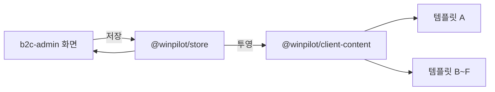

# Admin Mapping — B2C Admin

> **여기서 정한 값이 고객 화면의 어디에 나타나는지**를 적는다.
> 고객 화면 쪽 같은 이름의 문서는 방향이 반대다 — 거기서는 "이 화면의 값이 어느 어드민에서
> 오는가" 를 묻는다. 같은 표를 두 방향으로 적어 두는 이유는, 화면을 고치는 사람이 자기 화면에서
> 출발해 읽기 때문이다. **여기는 값을 내보내는 쪽이고, 저기는 받는 쪽이다.**

근거는 `apps/b2c-admin/lib/screen-specs.ts` 다. 각 화면 명세의 `admin` 필드가 곧 이 문서의 오른쪽 칸이다.

## 1. 값이 흐르는 길

**통로는 공유 시드 패키지 `@winpilot/store` 한 곳이다. 서버도 API 도 아니다.**
이 저장소는 프론트엔드 전용이라 값을 담아 둘 데이터베이스가 없고, 두 앱이 같은 워크스페이스
패키지를 의존하는 것이 유일한 연결이다. 어드민의 `lib/data/*.ts` 는 값을 갖지 않고 이 패키지를
그대로 재수출한다 — 어드민과 고객 화면이 각자 시드를 들면 두 화면이 서로 다른 것을 보여 준다.

투영 단계에서 **거를 것은 거른다.** 숨김 처리한 상품·공지·카테고리, 노출 기간이 끝난 배너는
고객 화면까지 오지 않는다. 고객 화면이 다시 판단하면 템플릿 여섯 벌이 각자 다르게 판단한다.

## 2. 어드민 화면 → 고객 화면

`pages.manifest.ts` 의 43개 전부다. 고객 화면에 나타나지 않는 것은 **`운영 전용`** 으로 적는다.

### 2.1 대시보드 · 계정

| 어드민 화면 | 경로 | 나타나는 고객 화면 |
|---|---|---|
| Dashboard | `/` | `운영 전용` |
| Login | `/login` | `운영 전용` — 고객 화면과 계정이 다르다 |

### 2.2 사용자

| 어드민 화면 | 경로 | 나타나는 고객 화면 |
|---|---|---|
| Users | `/users` | 마이페이지 (`/mypage`) — 여기서 바꾼 등급이 혜택에 반영된다 |
| Users Staff | `/users/admins` | `운영 전용` |
| Users Grades | `/users/grades` | 마이페이지 · 상품 상세 — 등급별 적립률이 여기서 온다 |

### 2.3 상품

| 어드민 화면 | 경로 | 나타나는 고객 화면 |
|---|---|---|
| Product Categories | `/products/categories` | 헤더 메뉴 · 상품 목록 (`/products`) — 분류를 늘리면 고객 화면 메뉴도 늘어난다 |
| Product List | `/products` | 상품 목록 · 상품 상세 · 홈 — 여기서 끈 상품은 어느 줄에도 나오지 않는다 |
| Product Create | `/products/new` | 상품 목록 · 상품 상세 |
| Product Detail | `/products/[productId]` | 상품 상세 · 장바구니 · 결제 |
| Product Sales | `/products/sales` | 주문 내역 (`/orders`) · 주문 상세 — 여기서 넣은 운송장이 고객 화면에 뜬다 |
| Product Sale Detail | `/products/sales/[orderId]` | 주문 상세 (`/orders/[orderId]`) |
| Product Reviews | `/products/reviews` | 상품 상세의 리뷰 탭 — 숨긴 리뷰는 고객 화면까지 오지 않는다 |
| Product Coupons | `/products/coupons` | 쿠폰함 (`/mypage/coupons`) · 결제 — 발급 대상이 비어 있으면 '쿠폰 받기' 탭에 나온다 |

상품 화면에서 켠 값과 고객 화면의 개수가 다른 것은 정상이다. 숨김(`visible: false`) 상품은
투영 단계에서 걸러진다 — **어드민 12개 · 고객 11개가 맞는 상태다.**

신상품·베스트 태그는 이 표에 없다. 운영자가 붙이는 값이 아니라 등록일·판매량으로 **자동 분류**
되기 때문이다(`lib/data/product-tags.ts`). 손으로 붙일 수 있게 하면 두 기준이 생긴다.

### 2.4 문의

| 어드민 화면 | 경로 | 나타나는 고객 화면 |
|---|---|---|
| Inquiries | `/inquiries` | 마이페이지 문의 내역 (`/mypage/inquiries`) — 여기서 쓴 답변이 고객 화면에 뜬다 |
| Inquiry Settings | `/inquiries/settings` | 문의하기 (`/contact`) — 여기서 정한 분류가 고객 화면의 선택 목록이 된다 |

고객이 `/contact` 에서 보낸 문의는 같은 기록으로 `/inquiries` 목록에 쌓인다. **운영자가 답을 다는
곳과 고객이 답을 읽는 곳이 한 자원이다** — 두 벌이면 답을 달아도 고객 화면이 조용하다.

### 2.5 콘텐츠

| 어드민 화면 | 경로 | 나타나는 고객 화면 |
|---|---|---|
| Content Notices | `/contents/notices` | 공지사항 목록 (`/notices`) · 공지 상세 |
| Content Notice Create | `/contents/notices/new` | 공지사항 목록 · 공지 상세 |
| Content Notice Detail | `/contents/notices/[noticeId]` | 공지 상세 (`/notices/[noticeId]`) |
| Content FAQ | `/contents/faqs` | FAQ 목록 (`/faqs`) · FAQ 상세 — 분류 이름도 이 화면에서 정한다 |
| Content News | `/contents/news` | 뉴스 목록 (`/news`) · 뉴스 상세 |
| Content News Create | `/contents/news/new` | 뉴스 목록 · 뉴스 상세 |
| Content News Detail | `/contents/news/[newsId]` | 뉴스 상세 (`/news/[newsId]`) — 본문 대신 요약과 원문 링크를 관리한다 |
| Content Portfolios | `/contents/portfolios` | 포트폴리오 (`/portfolios`) |
| Content Portfolio Create | `/contents/portfolios/new` | 포트폴리오 |
| Content Portfolio Detail | `/contents/portfolios/[portfolioId]` | 포트폴리오 |

등록 직후에는 숨김 상태다 — 다 쓰기 전에 고객 화면에 뜨지 않게 한다.
포트폴리오 화면의 연도 탭은 따로 정하지 않는다. **기간에서 뽑는다** — 항목을 넣을 때마다
탭을 손으로 맞추면 언젠가 빈 탭이 생긴다.

### 2.6 배너

| 어드민 화면 | 경로 | 나타나는 고객 화면 |
|---|---|---|
| Banners | `/banners` | 홈의 히어로 배너 |
| Banner Create | `/banners/new` | 홈의 히어로 배너 |
| Banner Detail | `/banners/[bannerId]` | 홈의 히어로 배너 |
| Banner Popups | `/banners/popups` | 홈 — 처음 들어온 사람에게 뜬다 |
| Banner Popup Create | `/banners/popups/new` | 홈 |
| Banner Popup Detail | `/banners/popups/[popupId]` | 홈 |

**배너 순서가 곧 고객 화면 넘김 순서다.** 노출 기간이 지난 배너는 숨겨지는 것이 아니라
고객 화면이 아예 받지 않는다.

### 2.7 회사

| 어드민 화면 | 경로 | 나타나는 고객 화면 |
|---|---|---|
| Company About | `/company/about` | 회사소개 (`/company`) |
| Company History | `/company/history` | 연혁 (`/company/history`) |

회사 소개의 대표 이미지 자리는 고객 화면과 **1:1 로 맞춘다** — 어드민에서 본 것이 그대로 나가야
운영자가 저장하고 나서 고객 화면을 확인하러 가지 않는다.

### 2.8 통계

| 어드민 화면 | 경로 | 나타나는 고객 화면 |
|---|---|---|
| Statistics Home | `/statistics` | `운영 전용` |
| Statistics Periods | `/statistics/periods` | `운영 전용` |
| Statistics Pages | `/statistics/pages` | `운영 전용` |
| Statistics Revenue | `/statistics/revenue` | `운영 전용` |

통계는 값을 **읽기만 한다.** 고객 화면으로 나가는 값이 없고, 다른 화면의 시드에서 뽑은 숫자라
대시보드가 상품 5건이라 하는데 목록에 4건만 있는 일이 없어야 한다.

### 2.9 설정

| 어드민 화면 | 경로 | 나타나는 고객 화면 |
|---|---|---|
| Settings Supplier | `/settings/supplier` | 푸터 · 회사소개의 사업자 정보 표 |
| Settings SEO | `/settings/seo` | 모든 화면의 메타 정보 (`<title>` · 설명 · 공유 이미지) |
| Settings Terms | `/settings/terms` | 이용약관 (`/terms`) |
| Settings Privacy | `/settings/privacy` | 개인정보 처리방침 (`/privacy`) |

**값을 템플릿에 박아 두지 않는다.** 박아 두면 상호 한 줄을 고칠 때마다 여섯 템플릿을 다시 배포해야 한다.

### 2.10 시스템

| 어드민 화면 | 경로 | 나타나는 고객 화면 |
|---|---|---|
| Components | `/ssot/components` | `운영 전용` — 고객사에도 열리지 않는 개발 도구다 |
| Result | `/result` | `운영 전용` — 어드민 안에서 끝난다. 고객 화면의 `/result` 와 컴포넌트만 같다 |

## 3. 어드민에만 있고 고객 화면에 없는 것

| 자원 | 어드민 화면 | 왜 고객 화면에 없나 |
|---|---|---|
| `staff` | 관리자 (`/users/admins`) | 운영자 계정이다. 고객이 알 이유가 없다 |
| `analytics` · `pageview` · `revenue` | 통계 네 화면 | 집계 결과이지 고객에게 보여 줄 값이 아니다 |
| `site.dashboard` | 대시보드 (`/`) | 오늘 처리할 일을 모은 화면이다 |
| `site.library` | 컴포넌트 갤러리 (`/ssot/components`) | 개발용 면이다 |
| `popup` | 배너 > 팝업 | 고객 화면에는 **화면이 아니라 홈 위에 뜨는 창**으로 나타난다 |
| `grade` 정의 | 사용자 > 등급 | 고객은 자기 등급만 본다. 등급표 자체를 고치는 화면은 없다 |
| 업태·업종 분류 | 공급자 정보 안의 선택 목록 | 사업자 등록 정보를 채우기 위한 것이라 고객 화면에 나가지 않는다 |

## 4. 고객 화면에만 있고 어드민이 손대지 못하는 것

| 고객 화면 | 값이 어디 있나 | 왜 어드민에 없나 |
|---|---|---|
| 장바구니 (`/cart`) | 브라우저 (`app/_components/cart-store.ts`) | **고객이 담는 자리다.** 운영자가 남의 장바구니를 여는 화면은 두지 않는다 |
| 관심 상품 | 브라우저 (`wishlist-store.ts`) | 위와 같다 |
| 로그인 상태 | 브라우저 (`session-store.ts`) | 서버가 없어 저장할 곳이 없다 |
| 알람 (`/alarms`) | `@winpilot/store` | 발송하는 어드민 화면이 아직 없다 |
| 결제 (`/orders/new`) | — | **운영자는 주문을 만들지 않는다.** 고객이 만든 것을 처리할 뿐이다 |
| 회원가입 (`/signup`) | — | 어드민은 사용자 목록 안 모달에서 추가한다. 별도 라우트가 없다 |
| 내 정보 수정 (`/mypage`) | — | 어드민은 사용자 목록의 상세 모달에서 같은 항목을 고친다 |
| FAQ 상세 (`/faqs/[faqId]`) | — | 운영자는 목록 화면의 모달에서 문답을 고친다 |
| 소셜 로그인 · 결제 수단 | — | **사내 어드민**의 OAuth · PG 설정이다. 고객사가 직접 만지면 로그인·결제가 멈춘다 |

장바구니·관심 상품·로그인 상태 셋은 서버가 생기면 **그 세 파일만** 바뀐다.
지금 어드민에서 볼 수 없는 것이 아니라, 볼 값이 아직 브라우저 밖으로 나오지 않는다.

## 5. 워딩이 다른 자리

같은 자원인데 두 앱에서 다르게 부르는 것들이다. **엔티티 이름이 진짜 이름**이고, 화면에 적히는
말은 각 화면의 사용자에게 맞춘 것이다. 전체 대조표는 `docs/coding-conventions.md` 3장에 있다.

| 엔티티 | 어드민 | 고객 화면 |
|---|---|---|
| `order` | 판매 | 주문 — 주문번호(`S-24081`)가 양쪽에서 같다 |
| `banner` | 배너 > 메인 비주얼 | 홈의 히어로 |
| `profile` | 회사 > 소개 | 회사소개 |
| `milestone` | 회사 > 연혁 | 연혁 |
| `inquiry.settings` | 문의 > 설정 | 문의하기 — 운영자는 폼을 만들고 고객은 폼을 쓴다 |
| `status.result` | 처리 결과 | 완료 · 실패 — 세 앱이 한 컴포넌트(`StatusScreen`)를 쓴다 |

## 6. 어긋남을 막는 검사

| 명령 | 보는 것 |
|---|---|
| `pnpm spec:check` | 기능 등록 · 경로 꼬리 · 컴포넌트 이름 규칙 · 용어 사전 · 매니페스트 |
| `pnpm sync:check` | 레지스트리에 적힌 컴포넌트 이름이 **실제 파일에도** 그 이름으로 있는지 |
| `pnpm ssot:extract` · `pnpm ssot:verify` | 실행 중인 화면과 Figma 결과의 수치 비교 |

`spec:check` 는 레지스트리 안에서의 규칙만 본다. 등록만 해 두고 파일을 다른 이름으로 만들어도
통과하므로 `sync:check` 를 따로 둔다.

이 문서와 실제 화면이 어긋나는 것은 기계가 잡지 못한다. `lib/screen-specs.ts` 의 `missingSpecs()`
가 **명세가 없는 화면**은 알려 주지만, 명세에 적힌 `admin` 값이 실제 고객 화면과 맞는지는 사람이
본다 — 화면을 고칠 때 명세를 같이 고치는 것 말고 다른 방법이 없다.
