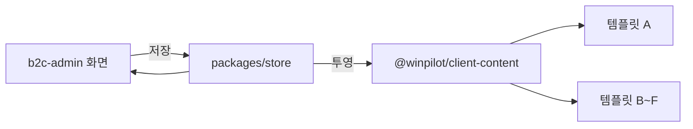

# 어드민 연동 명세 — B2C Client 템플릿 A

> 고객 화면의 **모든 값**은 어드민이 저장한 것을 옮겨 담은 것이다.
> 원본은 `packages/store` 한 곳뿐이고, `@winpilot/client-content` 가 고객 화면 모양으로 바꾼다.
> 시드를 두 벌 두면 "어드민에서 상품을 4개 보는데 고객 화면에는 12개" 가 되고,
> 그 순간 어느 쪽이 맞는지 아무도 모른다.

## 1. 값이 흐르는 길

투영 단계에서 **거를 것은 거른다.** 숨김 처리한 상품·공지·카테고리, 노출 기간이 끝난 배너는
고객 화면까지 오지 않는다. 고객 화면이 다시 판단하면 템플릿마다 다르게 나타난다.

## 2. 워딩이 다른 것

같은 자원인데 두 화면에서 다르게 부르는 것들이다. **엔티티 이름이 진짜 이름**이고,
화면에 적히는 말은 각 화면의 사용자에게 맞춘 것이다.

| 엔티티 | 고객 화면 | 어드민 | 비고 |
|---|---|---|---|
| `order` | 주문 | **판매** | 주문번호(S-2408x)가 양쪽에서 같다 |
| `profile` | 회사 소개 | 회사 > 회사 소개 | 단일 자원이라 등록·삭제가 없다 |
| `inquiry.settings` | 문의하기(폼) | 문의 > 설정 | 고객은 폼을 쓰고, 운영자는 폼을 만든다 |
| `status.result` | 완료·실패 | 처리 결과 | 세 앱이 한 컴포넌트를 쓴다 |
| `milestone` | 연혁 | 회사 > 연혁 | |

## 3. 화면별 연동표

### 3.1 상품

| 고객 화면 | 값 | 어드민 |
|---|---|---|
| `/products` | 상품·가격·재고 | 상품 > 상품 목록 |
| | 1Depth·2Depth 탭, 필터 서랍의 분류 | 상품 > 카테고리 (`/products/categories`) |
| | 신상품·베스트 태그 | 등록일·판매량으로 **자동 분류** (`productTags`) |
| `/products/[productId]` | 이름·판매가·정가·상세 설명 | 상품 > 상품 등록 |
| | 색상·사이즈·재고 | 상품 등록의 **옵션** 섹션 |
| | 적립금·배송 문구 | 상품 등록의 적립·배송 정책 |
| | 대표 이미지 | 상품 등록의 이미지 업로드 (없으면 벡터 그림) |
| | 리뷰 | store `REVIEWS` — 어드민 리뷰 화면이 생기면 그 화면이 원본 |

숨김(`visible: false`) 상품은 고객 화면에 오지 않는다. 어드민 12개 · 고객 11개가 정상이다.

### 3.2 주문 · 장바구니

| 고객 화면 | 값 | 어드민 |
|---|---|---|
| `/cart` | 담긴 상품의 이름·가격·재고 | 상품 목록 |
| `/orders/new` (결제) | 쿠폰 | store `COUPONS` |
| | 배송지·연락처 | 사용자 > 사용자 목록의 회원 정보 |
| | 결제 수단·구분값 | **사내 어드민**의 PG 설정 |
| `/orders` · `/orders/[orderId]` | 주문·결제 상태·배송 상태 | **판매** 목록 (`/products/sales`) |
| | 운송장·택배사 | 판매 상세에서 운영자가 등록 |

### 3.3 콘텐츠

| 고객 화면 | 어드민 |
|---|---|
| `/notices` · `/notices/[noticeId]` | 콘텐츠 > 공지사항 (`/contents/notices`) |
| `/faqs` · `/faqs/[faqId]` | 콘텐츠 > FAQ (`/contents/faqs`) — 분류 이름도 같은 화면에서 |
| `/news` · `/news/[newsId]` | 콘텐츠 > 뉴스 — 어드민은 **요약과 원문 링크**만 관리한다 |
| `/portfolios` | 콘텐츠 > 포트폴리오. 탭의 연도는 **기간**에서 뽑는다 |

### 3.4 회사 · 설정

| 고객 화면 | 값 | 어드민 |
|---|---|---|
| `/company` | 소개 본문·대표자·설립일 | 회사 > 회사 소개 (`/company/about`) |
| | **대표 이미지**(21:9, 한 장) | 같은 화면의 이미지 업로드. 없으면 자리표시자 |
| | 사업자 정보 표 | 설정 > 공급자 정보 (`/settings/supplier`) |
| `/company/history` | 연혁 | 회사 > 연혁 (`/company/milestones`) |
| `/terms` · `/privacy` | 본문·버전·시행일 | 설정 > 약관 정보 |
| 헤더·푸터 | 회사명·로고·사업자 정보 | 설정 > 공급자 정보 |
| `<title>`·설명 | SEO 값 | 설정 > SEO |

### 3.5 문의 · 계정

| 고객 화면 | 값 | 어드민 |
|---|---|---|
| `/contact` | 문의 유형·입력 항목·필수 여부·안내 문구·첨부 규격 | 문의 > 설정 (`/inquiries/settings`) |
| | 보낸 문의 | 문의 > 목록에 **Path `/contact`** 로 쌓인다 |
| `/mypage/inquiries` | 내 문의와 **운영자가 단 답변** | 문의 > 목록 (같은 기록) |
| `/mypage` | 이름·연락처·주소·마케팅 동의 | 사용자 > 사용자 목록의 상세 |
| | 등급·적립금 | 사용자 > 등급 (`/users/grades`) 기준으로 산정 |
| `/signup` | 수집 항목 | 사용자 > 사용자 추가(목록 안 모달)와 같은 목록 |
| `/login` | 검증 규칙 | 어드민 로그인과 한 쌍 (기능 `user.auth`) |
| 소셜 로그인 | Client ID 등 | **사내 어드민**의 OAuth 설정 |

### 3.6 홈

| 구획 | 어드민 |
|---|---|
| 히어로 배너 | 배너 > 메인 비주얼 (`/banners`). 노출 순서는 어드민이 자동으로 매긴 값 |
| 바로가기 타일 | 상품 > 카테고리 + 고정 바로가기 |
| 신상품·베스트 줄 | 상품 목록 + 자동 분류 태그 |
| 카테고리 탐색 | 상품 > 카테고리 (1Depth·2Depth) |

## 4. 아직 어드민 화면이 없는 것

값은 이미 `packages/store` 에 있다. 화면이 생기면 **옮길 것 없이** 그 화면이 원본이 된다.

| 값 | 파일 | 지금 쓰는 곳 |
|---|---|---|
| 쿠폰 | `coupons.ts` | 쿠폰함 · 결제 화면 |
| 리뷰 | `reviews.ts` | 상품 상세의 리뷰 탭 |
| 닉네임 생성 규칙 | `nickname.ts` | 회원가입 · 내 정보 수정 |

## 5. 브라우저에만 있는 것

서버가 없어 저장할 곳이 없는 값이다. 서버가 생기면 **이 파일들만** 바뀐다.

| 값 | 파일 | 비고 |
|---|---|---|
| 장바구니 | `app/_components/cart-store.ts` | 첫 방문에는 `ACCOUNT.cart` 시드로 시작 |
| 관심 상품 | `app/_components/wishlist-store.ts` | 상품 아이디만 담는다 |
| 로그인 상태 | `app/_components/session-store.ts` | 기본값은 로그인 |

## 6. 어긋남을 막는 검사

| 명령 | 보는 것 |
|---|---|
| `pnpm spec:check` | 기능 등록·경로 꼬리·컴포넌트 이름 규칙·용어 사전·매니페스트 |
| `pnpm sync:check` | 레지스트리에 적힌 컴포넌트 이름이 **실제 파일에도** 그 이름으로 있는지 |
| `pnpm ssot:extract` · `pnpm ssot:verify` | 실행 중인 화면과 Figma 결과의 수치·픽셀 비교 |

`spec:check` 는 레지스트리 안에서의 규칙만 본다. 등록만 해 두고 파일을 다른 이름으로 만들어도
통과하므로 `sync:check` 를 따로 둔다 — 실제로 네 화면이 어긋나 있었다.
