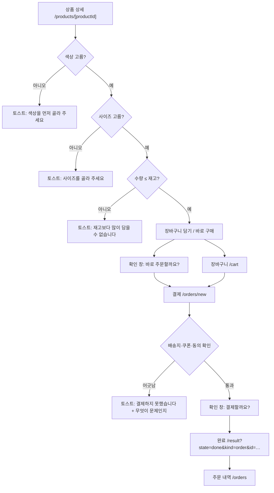
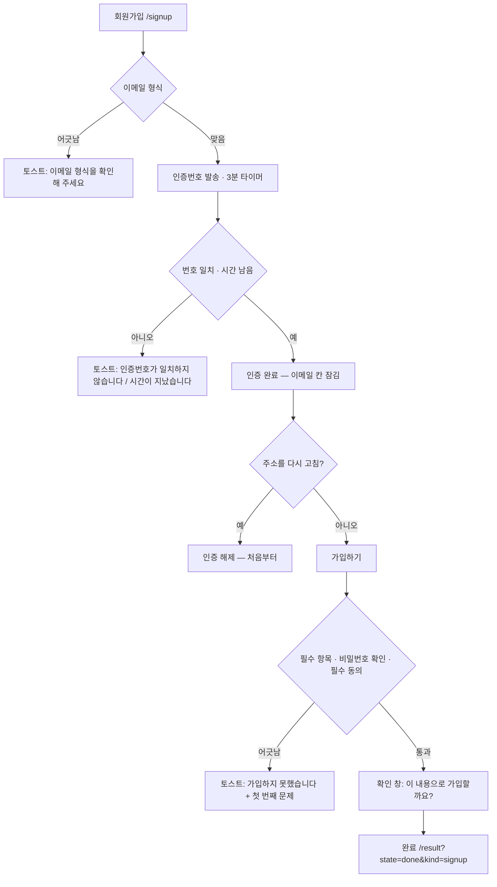
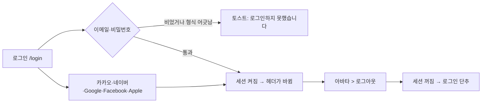
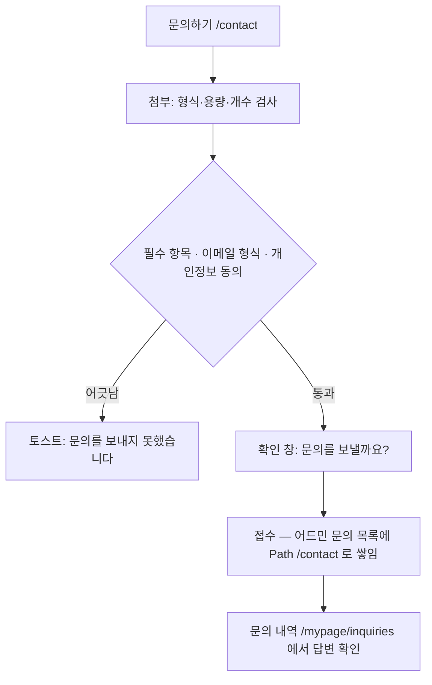
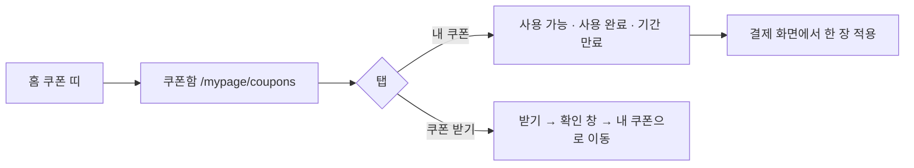
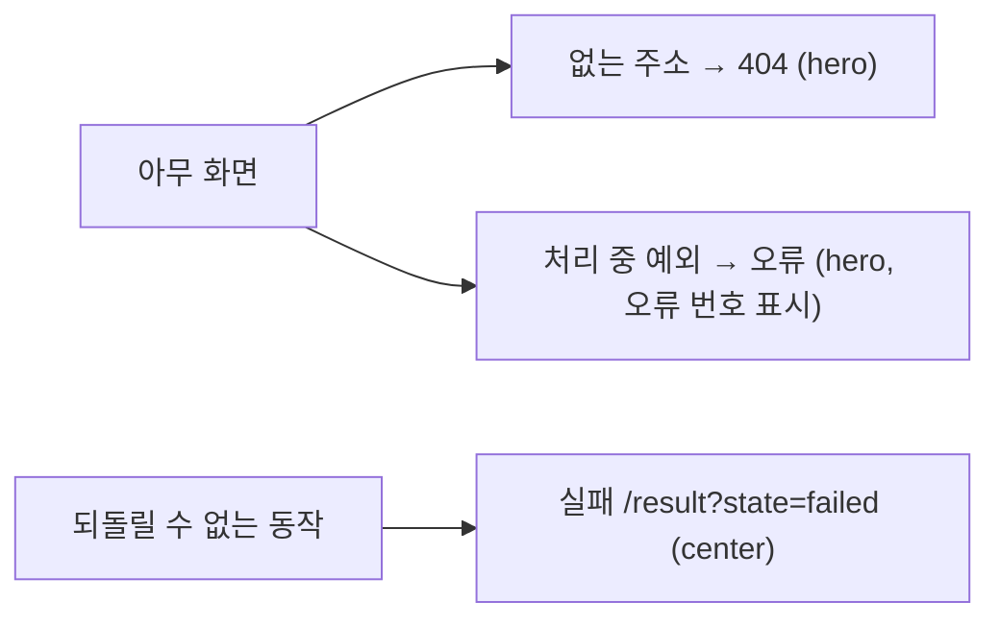

# Flow Chart — B2C Client 템플릿 A

> 지금 화면에 실제로 구현된 흐름만 적는다. 서버가 없으므로 저장은 브라우저(`localStorage`)에서
> 일어나고, 서버가 생기면 바뀌는 곳은 각 절의 **경계** 표시로 적어 둔다.

## 1. 구매

- 품절 옵션은 **누를 수 없다**(`disabled` + 취소선). 눌러 놓고 마지막에 막으면 그때까지의 선택이 헛수고가 된다.
- 담기·바로 구매 앞에서 **같은 검사**를 돌린다. 한쪽만 막으면 다른 길로 같은 문제가 들어온다.
- **경계**: 장바구니와 주문은 `app/_components/cart-store.ts` 가 브라우저에 보관한다. 서버가 생기면 이 파일만 바뀐다.

## 2. 회원가입 (이메일 인증)

인증 뒤 주소를 고치면 인증이 풀린다 — 그러지 않으면 인증만 받아 놓고 다른 주소로 가입할 수 있다.

## 3. 로그인 · 로그아웃

실패 안내는 **어느 항목이 틀렸는지 말하지 않는다** — 계정이 있는지를 알려 주는 것과 같기 때문이다.

## 4. 문의

첨부는 **고른 순간** 걸러 낸다. 보내고 나서 막으면 적은 내용이 통째로 날아간다.

## 5. 쿠폰

## 6. 오류

## 7. 안내가 뜨는 자리

| 종류 | 자리 | 쓰는 곳 |
|---|---|---|
| 토스트 | 화면 **하단 정중앙** | 성공·실패·정보. 무엇을 했는지 한 줄 덧붙인다 |
| 확인 창 | 화면 가운데, 뒤는 어둡게 | 삭제·주문·저장처럼 되돌리기 어려운 동작 앞 |
| 결과 화면 | 본문 가운데 | 흐름이 **끝난** 뒤 (주문·가입) |

토스트만으로 끝내지 않는 동작이 있다: 가입·결제는 결과 화면으로 옮긴다. 폼에 남으면 방금 한 일이
끝난 것인지 알 수 없다.
