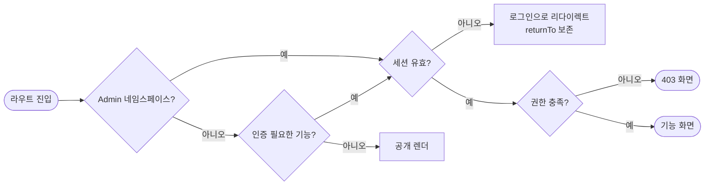
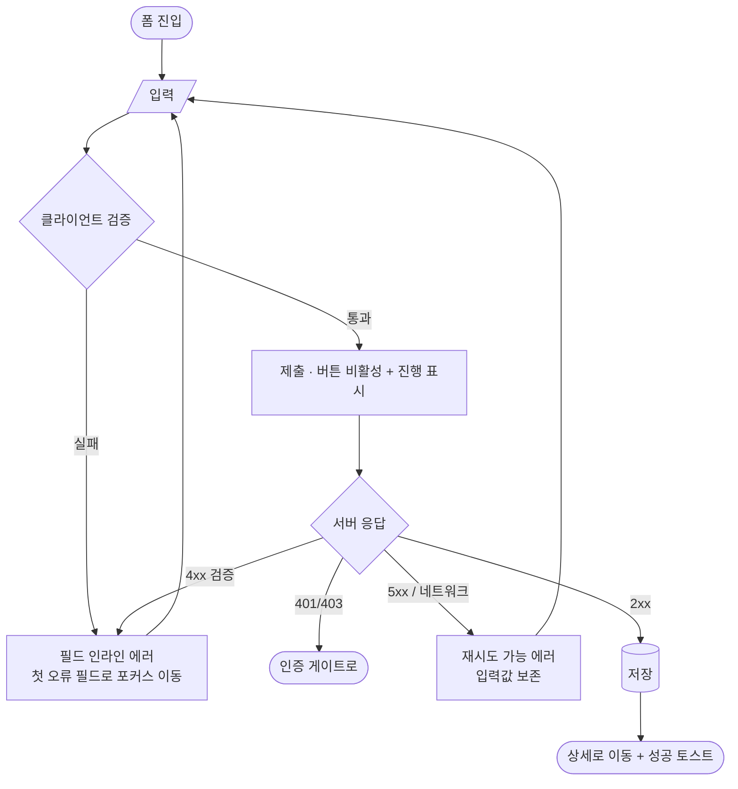
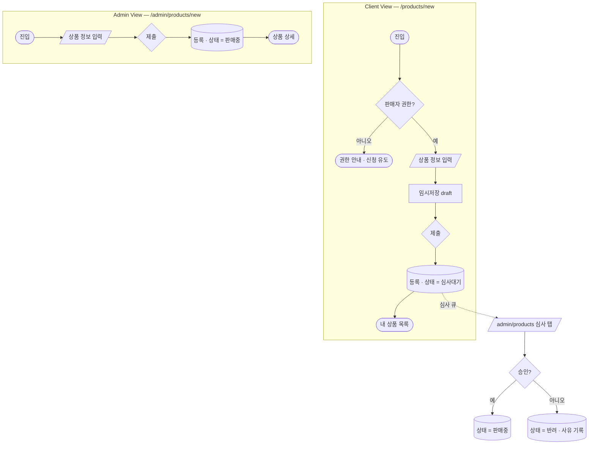

# 3. Flow Chart

> 표기: Mermaid `flowchart`. 도구 없이 diff 가 읽히고, Figma 플러그인 리포트에도 그대로 렌더된다.

## 3.1 표기 규약

| 기호 | 의미 |
|---|---|
| `([시작])` | 진입점 (사용자 의도 또는 라우트 진입) |
| `[처리]` | 시스템 처리 |
| `{분기}` | 조건 |
| `[/입력/]` | 사용자 입력 |
| `[(저장)]` | 영속화 |
| `([종료])` | 종료 상태 |

- 노드 라벨에 **Feature ID** 를 병기한다 (`상품 등록<br/>product.create`). 플로우와 코드가 이어진다.
- Client 전용 경로는 `:::client`, Admin 전용은 `:::admin` 클래스로 표시한다.
- 실패 경로를 생략하지 않는다. 성공 경로만 그린 플로우는 명세가 아니라 그림이다.

```
classDef client fill:#eef3ff,stroke:#3b5bfd;
classDef admin  fill:#f6f7f9,stroke:#5b6271;
```

## 3.2 공통 플로우 — 인증 게이트

두 뷰의 가장 큰 구조적 차이다.



- Client: 대부분 공개, 일부 기능만 인증 필요.
- Admin: `/admin/**` **전체**가 인증 필요. 미인증은 예외 없이 `/admin/login` 으로.

## 3.3 공통 플로우 — 폼 제출

`create` / `edit` 액션이 공유하는 골격이다. 뷰가 달라도 이 골격은 같아야 한다.



**입력값 보존은 규약이다.** 서버 오류로 사용자가 입력을 다시 치게 만들지 않는다.

## 3.4 상품 등록 — Client vs Admin 대조

같은 `product.create` 지만 뷰마다 다른 부분을 한 화면에서 본다.



*(시드 예시 — 실제 도메인 확정 시 교체)*

| 항목 | Client View | Admin View |
|---|---|---|
| 진입 권한 | 판매자 권한 필요 | 운영자 전체 |
| 임시저장 | 있음 (이탈 복구) | 없음 |
| 등록 직후 상태 | 심사대기 | 판매중 |
| 후속 이동 | 내 상품 목록 | 상품 상세 |

**두 뷰의 화면이 달라도 폼 골격(§3.3)과 검증 규칙은 공유한다.** 검증이 갈라지면
Client 에서 통과한 값이 Admin 에서 거부되는 모순이 생긴다.

## 3.5 에러 처리 정책

| 상황 | 표현 | 복구 |
|---|---|---|
| 필드 검증 실패 | 필드 하단 인라인 + 폼 상단 요약 | 해당 필드 포커스 |
| 권한 없음 (403) | 전체 화면 | 이전 화면 또는 홈 |
| 없음 (404) | 전체 화면 | 목록으로 |
| 서버 오류 (5xx) | 배너 + 재시도 버튼 | 입력값 보존 후 재시도 |
| 네트워크 단절 | 배너 | 자동 재시도 1회 후 수동 |

- 전체 화면 에러는 **라우트 세그먼트의 `error.tsx` / `not-found.tsx`** 로 구현한다.
- 토스트로만 처리하는 에러는 금지 — 사라지면 복구 경로가 없다.

## 3.6 작성 규칙

- 플로우는 **Feature 단위**로 작성하고, 두 뷰가 다르면 §3.4 처럼 `subgraph` 로 나란히 둔다.
- 공통 골격(§3.2, §3.3)을 다시 그리지 않고 참조한다. 복제하면 한쪽만 고쳐진다.
- 분기 조건은 코드에서 판정 가능한 문장으로 쓴다 ("권한 충족?" O / "적절한 경우" X).
