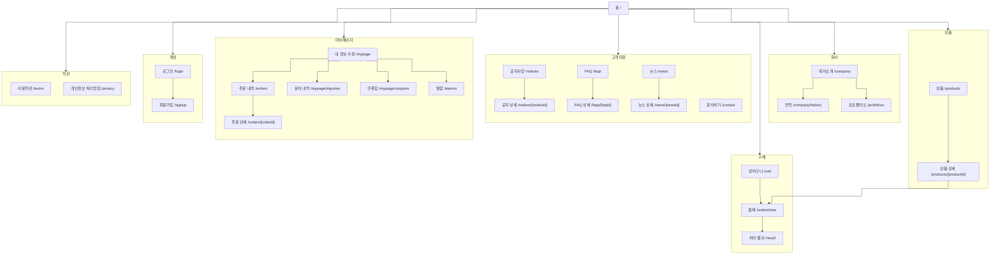

# IA — B2C Client 템플릿 A

> 노드의 원천은 `packages/spec/src/features.ts` 와 `apps/b2c-client-a/pages.manifest.ts`.
> 이 문서는 **지금 이 템플릿에 실제로 있는 화면**의 구조를 적는다. 계획이 아니라 현황이다.
> 검사: `pnpm spec:check` (등록·명명) · `pnpm sync:check` (레지스트리 이름과 파일 이름)

## 1. 화면 나무

선은 **직각(step)** 으로 그린다 — 곡선으로 두면 갈래가 많아질수록 어느 선이 어디로 가는지
따라가기 어렵다. 같은 이유로 묶음(subgraph)을 먼저 나누고 홈에서 묶음으로만 잇는다.
화면끼리의 선은 묶음 안에서만 그어 선이 서로 넘지 않게 한다.

신상품(`/products?tag=NEW`)·베스트(`?tag=BEST`)는 **화면이 아니라 상품 목록의 필터**라 도면에
넣지 않는다. 경로를 따로 두지 않는 이유는 같은 자원이기 때문이다 — 화면을 나누면 정렬·페이징·
빈 상태를 세 벌로 관리하게 된다.

## 2. 헤더 메뉴 (`buildNav()`)

메뉴 구성은 템플릿이 정하지 않는다. `@winpilot/client-content` 의 `buildNav()` 하나를
A~F 가 함께 쓰고, 템플릿은 **배치만** 정한다.

| 1Depth | 2Depth | 비고 |
|---|---|---|
| 회사소개 | 회사 소개 · 연혁 · 포트폴리오 | |
| 신상품 | — | 강조(굵게·브랜드색) |
| 베스트 | — | 강조 |
| 상품 | 어드민의 **1Depth 카테고리** | 카테고리를 늘리면 여기도 늘어난다 |
| 고객지원 | 공지사항 · FAQ · 뉴스 · 문의하기 | 고객지원 화면의 aside 와 같은 네 갈래 |

오른쪽 도구는 로그인 여부로 갈린다.

| 상태 | 오른쪽에 놓이는 것 |
|---|---|
| 로그인 | 검색 · 관심 · 알람(읽지 않은 수) · 장바구니 · 아바타(마이페이지 · 로그아웃) |
| 비회원 | 검색 · 장바구니 · **로그인** 단추 |

비회원에게 관심·알람을 감추는 이유: 담을 곳도 받을 알람도 없어 눌러도 빈 화면이 나온다.
장바구니는 비회원도 담을 수 있어 늘 둔다.

## 3. 두 개의 aside

목록을 갈래로 나눠 보는 화면은 **왼쪽 aside + 오른쪽 main** 한 뼈대를 쓴다.
상세로 들어가도 aside 는 그대로 두고 main 만 바뀐다.

| 뼈대 | 갈래 | 파일 |
|---|---|---|
| 고객지원 | 공지사항 · FAQ · 뉴스 · 문의하기 | `app/_components/SupportShell.tsx` |
| 마이페이지 | 내 정보 수정 · 주문 내역 · 문의 내역 · 쿠폰함 | `app/_components/MyPageShell.tsx` |

주문 내역이 `/mypage/orders` 가 아닌 `/orders` 인 이유: 주문은 마이페이지에 딸린 것이 아니라
**독립된 자원**이다(어드민의 '판매' 와 같은 것). 화면만 마이페이지 안쪽에 놓인다.

## 4. 깊이

| 깊이 | 예 | 규칙 |
|---|---|---|
| 1 | `/products` · `/notices` · `/mypage` | 목록·단일 화면 |
| 2 | `/products/[productId]` · `/mypage/coupons` | 상세·갈래 |
| 3 | *(없음)* | 3뎁스를 만들지 않는다 — 돌아올 길이 길어진다 |

## 5. 상태 화면

404 · 오류 · 완료 · 실패는 **한 컴포넌트**(`packages/ui` 의 `StatusScreen`)를 세 앱이 같이 쓴다.

| 화면 | 배치 | 자리 |
|---|---|---|
| 404 (`not-found.tsx`) | `hero` — 화면 전체, 오른쪽에 큰 도형 | 헤더 밖 |
| 오류 (`error.tsx`) | `hero` | 헤더 밖 |
| 완료·실패 (`/result`) | `center` — 결과 아이콘 · 안내 · 단추 | 헤더와 푸터 사이 |
