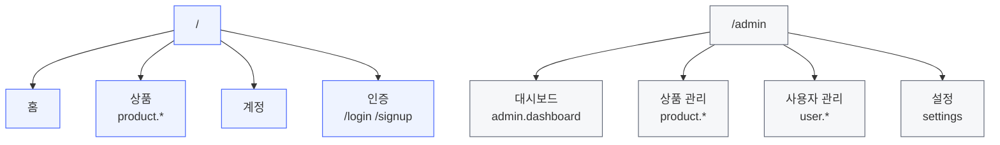

# 4. IA (Information Architecture)

> 노드의 원천은 `packages/spec/src/features.ts`. 이 문서는 그 위의 **구조와 규칙**을 정의한다.

## 4.1 최상위 구조



*(시드 — 도메인 확정 시 교체)*

## 4.2 뷰별 성격

| | Client View | Admin View |
|---|---|---|
| 대상 | 최종 사용자 | 운영자 |
| 진입 | 검색·공유 링크·직접 방문 | 로그인 후 대시보드 |
| 탐색 축 | **과업 중심** (사고 싶다, 찾고 싶다) | **자원 중심** (상품, 사용자, 주문) |
| 내비게이션 | 헤더 + 푸터, 얕게 | 사이드바 고정, 자원별 섹션 |
| 목록 밀도 | 낮음 (카드, 이미지 중심) | 높음 (테이블, 대량 처리) |
| SEO | 대상 | 제외 (`noindex`) |
| 深さ 상한 | 3뎁스 | 4뎁스 |

**같은 데이터라도 축이 다르다.** Client 의 "상품"은 탐색 대상이고 Admin 의 "상품"은 관리 자원이다.
이 차이를 인정하되, **Feature ID 와 용어는 공유한다** — 구조가 달라도 이름은 같아야 짝지어진다.

## 4.3 뎁스 규칙

```
Client   /                     1뎁스   홈
         /products             2뎁스   컬렉션
         /products/[productId] 3뎁스   단건
         /products/[productId]/edit  ← 4뎁스, 예외적으로 허용 (편집)

Admin    /admin                        1뎁스  대시보드
         /admin/products               2뎁스  컬렉션
         /admin/products/[productId]   3뎁스  단건
         /admin/products/[productId]/edit  4뎁스
```

- 4뎁스를 넘기지 않는다. 넘어야 한다면 자원 모델링이 잘못된 것이다.
- 뎁스가 곧 브레드크럼 깊이다. 3뎁스 이상은 브레드크럼 필수.

## 4.4 내비게이션 규칙

### Client View
- 헤더: 로고 · 주요 컬렉션 · 검색 · 계정
- 푸터: 회사 정보 · 정책 · 고객지원
- 브레드크럼: 3뎁스부터
- 모바일(375): 헤더 축약 + 드로어

### Admin View
- 사이드바: 자원별 섹션 고정, 현재 위치 항상 표시
- 상단바: 현재 자원명 · 전역 검색 · 계정
- 브레드크럼: 2뎁스부터 (자원 계층이 깊어 필수)
- 태블릿(768) 이하: 사이드바 접힘(아이콘만), 375 는 드로어

## 4.5 Figma 페이지 순번과의 관계

`pages.manifest.ts` 의 `order` 가 Figma 페이지 순서를 결정한다 (`1. Index`, `2. …`).
**IA 순서와 `order` 를 일치시킨다** — Figma 페이지 목록이 곧 사이트맵이 되도록.

권장 대역:

| 대역 | 용도 |
|---|---|
| 1–49 | Client View |
| 50–99 | Admin View |
| 100+ | 공통/시스템 (에러, 준비중 등) |

대역을 띄워두면 중간에 페이지를 끼울 때 전체 번호를 다시 매기지 않아도 된다.
페이지가 10개를 넘으면 `figmaPageName()` 이 자동으로 `01.` 형태로 패딩한다.

## 4.6 검색·필터 위치

| | Client View | Admin View |
|---|---|---|
| 전역 검색 | 헤더 (상품 중심) | 상단바 (전 자원 대상) |
| 컬렉션 필터 | 목록 상단, 접힘 기본 | 목록 상단, 펼침 기본 |
| 정렬 | 드롭다운 | 테이블 헤더 클릭 |

필터 상태는 URL 쿼리에 반영한다 ([1.4](01-path.md#14-쿼리-파라미터)) — 공유·뒤로가기가 동작해야 한다.

## 4.7 작성 규칙

- IA 노드는 반드시 Feature ID 를 갖는다. ID 없는 화면은 명세도 검증도 불가능하다.
- 한쪽 뷰에만 있는 노드는 그 이유를 표에 남긴다 (`VIEW_PARTIAL` 경고와 대응).
- 구조를 바꾸면 `features.ts` → `pages.manifest.ts` → 이 문서 순으로 갱신한다.
