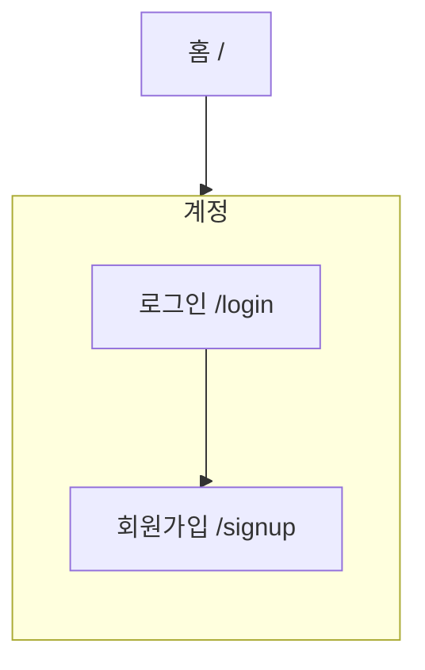

# IA — 계정

> 원본: `apps/b2c-client-a/lib/ia-groups.ts` · 생성: `pnpm docs:build`
> 이 파일은 **생성물**이다. 고칠 것은 원본이고, 여기서 고치면 다음 생성 때 지워진다.
> 검사: `pnpm spec:check` (등록·명명) · `pnpm sync:check` (레지스트리 이름과 파일 이름)

로그인하고, 없으면 만든다.

## 화면 나무

## 화면

| 화면 | 경로 | Figma 페이지 | 명세 |
|---|---|---|---|
| 로그인 | `/login` | Login | [기능](/feature/login) · [비기능](/non-functional/login) · [캡처](/page-view/login) |
| 회원가입 | `/signup` | Signup | [기능](/feature/signup) · [비기능](/non-functional/signup) · [캡처](/page-view/signup) |

## 이 갈래의 규칙

- 가입은 로그인 화면의 탭에서 들어간다 — 두 화면을 멀리 두면 계정이 없는 사람이 로그인 화면에서 막힌다.
- 가입이 끝나면 처리 결과 화면으로 보낸다(`/result?state=done&kind=signup`). 무엇이 끝났는지에 따라 돌아갈 곳이 달라진다.
