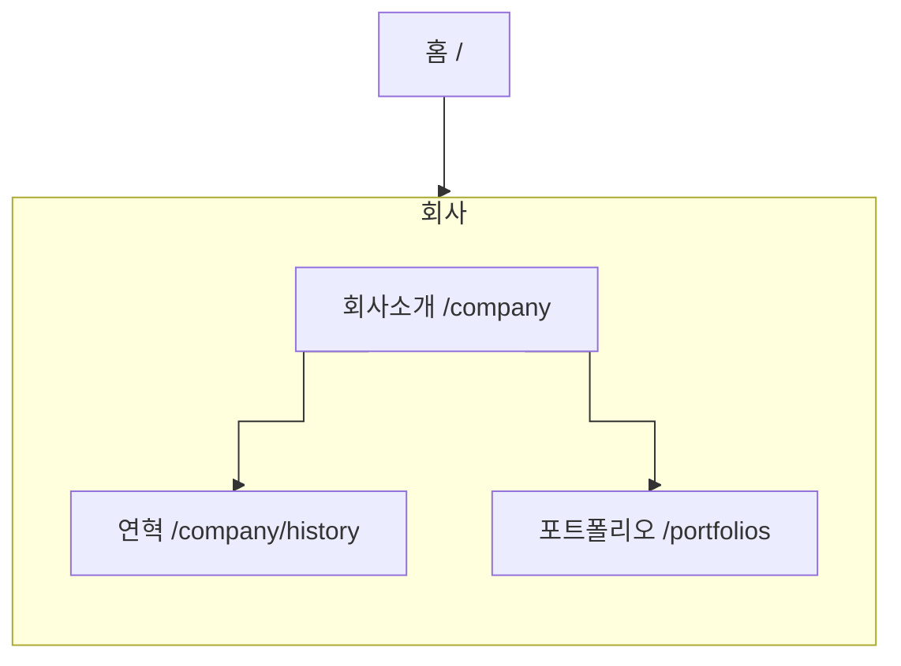

# IA — 회사

> 원본: `apps/b2c-client-a/lib/ia-groups.ts` · 생성: `pnpm docs:build`
> 이 파일은 **생성물**이다. 고칠 것은 원본이고, 여기서 고치면 다음 생성 때 지워진다.
> 검사: `pnpm spec:check` (등록·명명) · `pnpm sync:check` (레지스트리 이름과 파일 이름)

우리가 누구이고 무엇을 해 왔는지를 보여 준다.

## 화면 나무

## 화면

| 화면 | 경로 | Figma 페이지 | 명세 |
|---|---|---|---|
| 회사소개 | `/company` | Company | [기능](/feature/company) · [비기능](/non-functional/company) · [캡처](/page-view/company) |
| 연혁 | `/company/history` | Company History | [기능](/feature/company-history) · [비기능](/non-functional/company-history) · [캡처](/page-view/company-history) |
| 포트폴리오 | `/portfolios` | Portfolios | [기능](/feature/portfolios) · [비기능](/non-functional/portfolios) · [캡처](/page-view/portfolios) |

## 이 갈래의 규칙

- 헤더의 `회사소개` 2Depth 와 같은 세 갈래다 — 메뉴에만 있고 화면이 없는 항목을 만들지 않는다.
- 연혁·포트폴리오는 회사소개 아래에 놓이지만 주소는 각자 1뎁스다. 3뎁스를 만들면 돌아올 길이 길어진다.
- 대표 이미지·연혁 항목·포트폴리오 글은 모두 어드민이 넣는다 — 템플릿은 자리만 정한다.
