# IA — B2C Client 템플릿 A

> 원본: `apps/b2c-client-a/lib/ia-groups.ts` · 생성: `pnpm docs:build`
> 이 파일은 **생성물**이다. 고칠 것은 원본이고, 여기서 고치면 다음 생성 때 지워진다.
> 검사: `pnpm spec:check` (등록·명명) · `pnpm sync:check` (레지스트리 이름과 파일 이름)

지금 이 템플릿에 **실제로 있는 화면**의 구조다. 계획이 아니라 현황이다.
갈래별 도면과 규칙은 위 탭에서 본다.

## 1. 갈래

| 갈래 | 화면 | 하는 일 |
|---|---|---|
| [회사](/ia/company) | 3개 | 우리가 누구이고 무엇을 해 왔는지를 보여 준다. |
| [상품](/ia/products) | 2개 | 파는 것을 좁혀 가며 고르고, 고른 것을 자세히 본다. |
| [고객지원](/ia/support) | 7개 | 묻기 전에 찾아보게 하고, 찾지 못하면 물을 곳을 준다. |
| [구매](/ia/purchase) | 3개 | 담은 것을 결제하고 그 결과를 알린다. |
| [마이페이지](/ia/mypage) | 6개 | 내가 한 일과 나에게 온 것을 한자리에서 본다. |
| [계정](/ia/account) | 2개 | 로그인하고, 없으면 만든다. |
| [약관](/ia/policy) | 2개 | 동의한 것이 무엇인지 언제든 다시 읽게 한다. |

## 2. 화면 나무

```mermaid
%%{init: {"flowchart": {"curve": "step", "nodeSpacing": 55, "rankSpacing": 65, "useMaxWidth": true}} }%%
flowchart TD
  INDEX["홈 /"]

  subgraph company["회사"]
    direction TB
    COMPANY["회사소개 /company"]
    COMPANY_HISTORY["연혁 /company/history"]
    PORTFOLIOS["포트폴리오 /portfolios"]
    COMPANY --> COMPANY_HISTORY
    COMPANY --> PORTFOLIOS
  end

  subgraph products["상품"]
    direction TB
    PRODUCTS["상품 목록 /products"]
    PRODUCTS_DETAIL["상품 상세 /products/[productId]"]
    PRODUCTS --> PRODUCTS_DETAIL
  end

  subgraph support["고객지원"]
    direction TB
    NOTICES["공지사항 /notices"]
    NOTICES_DETAIL["공지 상세 /notices/[noticeId]"]
    FAQS["FAQ /faqs"]
    FAQS_DETAIL["FAQ 상세 /faqs/[faqId]"]
    NEWS["뉴스 /news"]
    NEWS_DETAIL["뉴스 상세 /news/[newsId]"]
    CONTACT["문의하기 /contact"]
    NOTICES --> NOTICES_DETAIL
    FAQS --> FAQS_DETAIL
    NEWS --> NEWS_DETAIL
  end

  subgraph purchase["구매"]
    direction TB
    CART["장바구니 /cart"]
    ORDERS_NEW["결제 /orders/new"]
    RESULT["처리 결과 /result"]
    CART --> ORDERS_NEW
    ORDERS_NEW --> RESULT
  end

  subgraph mypage["마이페이지"]
    direction TB
    MYPAGE["내 정보 수정 /mypage"]
    ORDERS["주문 내역 /orders"]
    ORDERS_DETAIL["주문 상세 /orders/[orderId]"]
    MYPAGE_INQUIRIES["문의 내역 /mypage/inquiries"]
    MYPAGE_COUPONS["쿠폰함 /mypage/coupons"]
    ALARMS["알람 /alarms"]
    MYPAGE --> ORDERS
    ORDERS --> ORDERS_DETAIL
    MYPAGE --> MYPAGE_INQUIRIES
    MYPAGE --> MYPAGE_COUPONS
    MYPAGE --> ALARMS
  end

  subgraph account["계정"]
    direction TB
    LOGIN["로그인 /login"]
    SIGNUP["회원가입 /signup"]
    LOGIN --> SIGNUP
  end

  subgraph policy["약관"]
    direction TB
    TERMS["이용약관 /terms"]
    PRIVACY["개인정보 처리방침 /privacy"]
  end

  INDEX --> company
  INDEX --> products
  INDEX --> support
  INDEX --> purchase
  INDEX --> mypage
  INDEX --> account
  INDEX --> policy
```

선은 **직각(step)** 으로 그린다 — 곡선으로 두면 갈래가 많아질수록 어느 선이 어디로 가는지
따라가기 어렵다. 같은 이유로 묶음을 먼저 나누고 홈에서 묶음으로만 잇는다. 화면끼리의 선은
묶음 안에서만 그어 선이 서로 넘지 않게 한다.

갈래를 넘는 이동(상품 상세 → 결제 같은 것)은 도면에 긋지 않고 그 갈래의 규칙에 적는다.
전부 그으면 도면이 그물이 되어 아무것도 읽히지 않는다.

## 3. 헤더 메뉴 (`buildNav()`)

메뉴 구성은 템플릿이 정하지 않는다. `@winpilot/client-content` 의 `buildNav()` 하나를
A~F 가 함께 쓰고, 템플릿은 **배치만** 정한다.

| 1Depth | 2Depth | 비고 |
|---|---|---|
| 회사소개 | 회사 소개 · 연혁 · 포트폴리오 | |
| 신상품 | — | 강조(굵게·브랜드색) |
| 베스트 | — | 강조 |
| 상품 | 어드민의 **1Depth 카테고리** | 카테고리를 늘리면 여기도 늘어난다 |
| 고객지원 | 공지사항 · FAQ · 뉴스 · 문의하기 | 고객지원 화면의 aside 와 같은 네 갈래 |

오른쪽 도구는 로그인 여부로 갈린다.

| 상태 | 오른쪽에 놓이는 것 |
|---|---|
| 로그인 | 검색 · 관심 · 알람(읽지 않은 수) · 장바구니 · 아바타(마이페이지 · 로그아웃) |
| 비회원 | 검색 · 장바구니 · **로그인** 단추 |

비회원에게 관심·알람을 감추는 이유: 담을 곳도 받을 알람도 없어 눌러도 빈 화면이 나온다.
장바구니는 비회원도 담을 수 있어 늘 둔다.

## 4. 두 개의 aside

목록을 갈래로 나눠 보는 화면은 **왼쪽 aside + 오른쪽 main** 한 뼈대를 쓴다.
상세로 들어가도 aside 는 그대로 두고 main 만 바뀐다.

| 뼈대 | 갈래 | 파일 |
|---|---|---|
| [고객지원](/ia/support) | 공지사항 · FAQ · 뉴스 · 문의하기 | `app/_components/SupportShell.tsx` |
| [마이페이지](/ia/mypage) | 내 정보 수정 · 주문 내역 · 문의 내역 · 쿠폰함 | `app/_components/MyPageShell.tsx` |

## 5. 깊이

| 깊이 | 예 | 규칙 |
|---|---|---|
| 1 | `/products` · `/notices` · `/mypage` | 목록·단일 화면 |
| 2 | `/products/[productId]` · `/mypage/coupons` | 상세·갈래 |
| 3 | *(없음)* | 3뎁스를 만들지 않는다 — 돌아올 길이 길어진다 |

## 6. 상태 화면

404 · 오류 · 완료 · 실패는 **한 컴포넌트**(`packages/ui` 의 `StatusScreen`)를 세 앱이 같이 쓴다.

| 화면 | 배치 | 자리 |
|---|---|---|
| 404 (`not-found.tsx`) | `hero` — 화면 전체, 오른쪽에 큰 도형 | 헤더 밖 |
| 오류 (`error.tsx`) | `hero` | 헤더 밖 |
| 완료·실패 ([`/result`](/ia/purchase)) | `center` — 결과 아이콘 · 안내 · 단추 | 헤더와 푸터 사이 |
