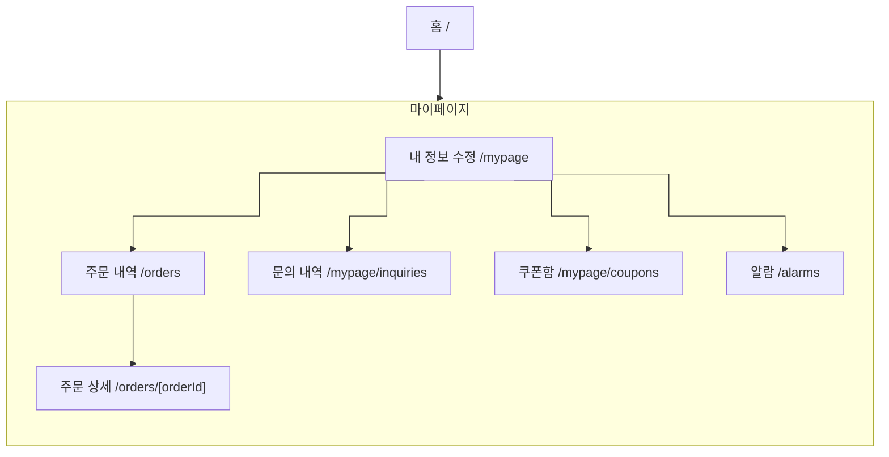

# IA — 마이페이지

> 원본: `apps/b2c-client-a/lib/ia-groups.ts` · 생성: `pnpm docs:build`
> 이 파일은 **생성물**이다. 고칠 것은 원본이고, 여기서 고치면 다음 생성 때 지워진다.
> 검사: `pnpm spec:check` (등록·명명) · `pnpm sync:check` (레지스트리 이름과 파일 이름)

내가 한 일과 나에게 온 것을 한자리에서 본다.

## 화면 나무

## 화면

| 화면 | 경로 | Figma 페이지 | 명세 |
|---|---|---|---|
| 내 정보 수정 | `/mypage` | My Page | [기능](/feature/mypage) · [비기능](/non-functional/mypage) · [캡처](/page-view/mypage) |
| 주문 내역 | `/orders` | Orders | [기능](/feature/orders) · [비기능](/non-functional/orders) · [캡처](/page-view/orders) |
| 주문 상세 | `/orders/[orderId]` | Order Detail | [기능](/feature/orders-detail) · [비기능](/non-functional/orders-detail) · [캡처](/page-view/orders-detail) |
| 문의 내역 | `/mypage/inquiries` | My Page Inquiries | [기능](/feature/mypage-inquiries) · [비기능](/non-functional/mypage-inquiries) · [캡처](/page-view/mypage-inquiries) |
| 쿠폰함 | `/mypage/coupons` | My Page Coupons | [기능](/feature/mypage-coupons) · [비기능](/non-functional/mypage-coupons) · [캡처](/page-view/mypage-coupons) |
| 알람 | `/alarms` | Alarms | [기능](/feature/alarms) · [비기능](/non-functional/alarms) · [캡처](/page-view/alarms) |

## 이 갈래의 규칙

- 주문 내역이 `/mypage/orders` 가 아니라 `/orders` 인 이유: 주문은 마이페이지에 딸린 것이 아니라 **독립된 자원**이다(어드민의 `판매` 와 같은 것). 화면만 마이페이지 안쪽에 놓인다.
- 네 갈래가 왼쪽 aside 하나를 함께 쓴다(`app/_components/MyPageShell.tsx`).
- 알람은 헤더에서도 바로 열린다 — 읽지 않은 수가 헤더에 붙어 있어서 마이페이지를 거치게 하면 한 번 더 누르게 된다.
