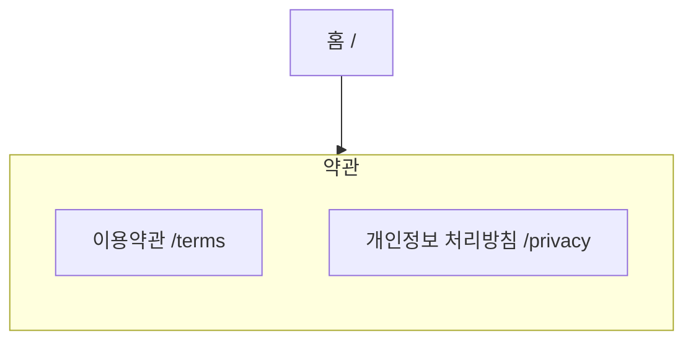

# IA — 약관

> 원본: `apps/b2c-client-a/lib/ia-groups.ts` · 생성: `pnpm docs:build`
> 이 파일은 **생성물**이다. 고칠 것은 원본이고, 여기서 고치면 다음 생성 때 지워진다.
> 검사: `pnpm spec:check` (등록·명명) · `pnpm sync:check` (레지스트리 이름과 파일 이름)

동의한 것이 무엇인지 언제든 다시 읽게 한다.

## 화면 나무

## 화면

| 화면 | 경로 | Figma 페이지 | 명세 |
|---|---|---|---|
| 이용약관 | `/terms` | Terms | [기능](/feature/terms) · [비기능](/non-functional/terms) · [캡처](/page-view/terms) |
| 개인정보 처리방침 | `/privacy` | Privacy | [기능](/feature/privacy) · [비기능](/non-functional/privacy) · [캡처](/page-view/privacy) |

## 이 갈래의 규칙

- 가입·결제에서 링크로 열리므로 로그인 없이 읽힌다.
- 본문은 어드민이 넣는다(`설정 > 서비스 이용약관 정보`·`개인정보 처리방침 정보`). 템플릿에 글을 박아 두면 고칠 때 배포를 해야 한다.
