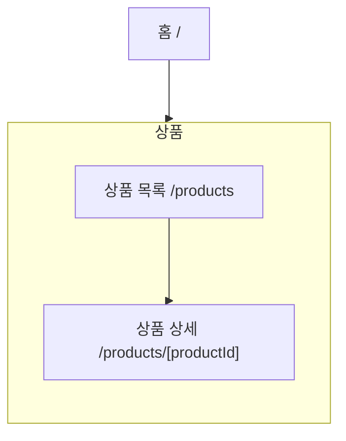

# IA — 상품

> 원본: `apps/b2c-client-a/lib/ia-groups.ts` · 생성: `pnpm docs:build`
> 이 파일은 **생성물**이다. 고칠 것은 원본이고, 여기서 고치면 다음 생성 때 지워진다.
> 검사: `pnpm spec:check` (등록·명명) · `pnpm sync:check` (레지스트리 이름과 파일 이름)

파는 것을 좁혀 가며 고르고, 고른 것을 자세히 본다.

## 화면 나무

## 화면

| 화면 | 경로 | Figma 페이지 | 명세 |
|---|---|---|---|
| 상품 목록 | `/products` | Product List | [기능](/feature/products) · [비기능](/non-functional/products) · [캡처](/page-view/products) |
| 상품 상세 | `/products/[productId]` | Product Detail | [기능](/feature/products-detail) · [비기능](/non-functional/products-detail) · [캡처](/page-view/products-detail) |

## 이 갈래의 규칙

- 신상품(`/products?tag=NEW`)·베스트(`?tag=BEST`)는 **화면이 아니라 목록의 필터**다. 화면을 나누면 정렬·페이징·빈 상태를 세 벌로 관리하게 된다.
- 분류·검색·가격은 주소에 남는다 — 새로고침과 공유에서 살아남아야 조건을 말로 설명하지 않는다.
- 재고가 0인 옵션도 목록에는 남긴다. 왜 못 고르는지가 보여야 한다.
