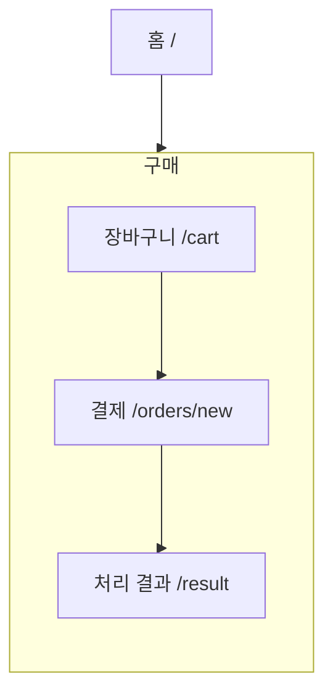

# IA — 구매

> 원본: `apps/b2c-client-a/lib/ia-groups.ts` · 생성: `pnpm docs:build`
> 이 파일은 **생성물**이다. 고칠 것은 원본이고, 여기서 고치면 다음 생성 때 지워진다.
> 검사: `pnpm spec:check` (등록·명명) · `pnpm sync:check` (레지스트리 이름과 파일 이름)

담은 것을 결제하고 그 결과를 알린다.

## 화면 나무

## 화면

| 화면 | 경로 | Figma 페이지 | 명세 |
|---|---|---|---|
| 장바구니 | `/cart` | Cart | [기능](/feature/cart) · [비기능](/non-functional/cart) · [캡처](/page-view/cart) |
| 결제 | `/orders/new` | Checkout | [기능](/feature/orders-new) · [비기능](/non-functional/orders-new) · [캡처](/page-view/orders-new) |
| 처리 결과 | `/result` | Result | [기능](/feature/result) · [비기능](/non-functional/result) · [캡처](/page-view/result) |

## 이 갈래의 규칙

- 상품 상세에서 장바구니를 거치지 않고 바로 결제로 들어올 수 있다(`/orders/new?productId=…`). 한 개만 사는 사람에게 담기를 시키지 않는다.
- 장바구니는 비회원도 쓴다 — 담을 때가 아니라 결제할 때 로그인을 묻는다.
- 결제할 것이 없으면 결제 단추가 잠긴다. 눌러 놓고 다음 화면에서 막으면 무엇이 잘못됐는지 늦게 안다.
- 처리 결과는 완료·실패가 **한 화면**이다(`/result?state=…`). 문구와 아이콘만 바뀐다.
