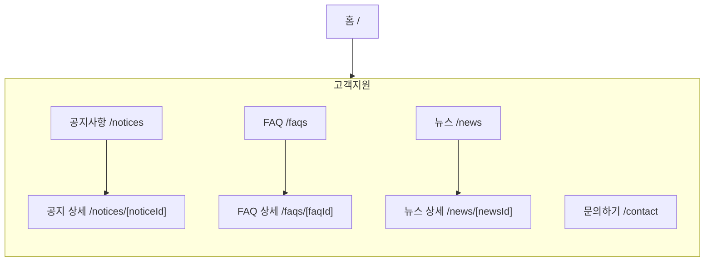

# IA — 고객지원

> 원본: `apps/b2c-client-a/lib/ia-groups.ts` · 생성: `pnpm docs:build`
> 이 파일은 **생성물**이다. 고칠 것은 원본이고, 여기서 고치면 다음 생성 때 지워진다.
> 검사: `pnpm spec:check` (등록·명명) · `pnpm sync:check` (레지스트리 이름과 파일 이름)

묻기 전에 찾아보게 하고, 찾지 못하면 물을 곳을 준다.

## 화면 나무

## 화면

| 화면 | 경로 | Figma 페이지 | 명세 |
|---|---|---|---|
| 공지사항 | `/notices` | Notices | [기능](/feature/notices) · [비기능](/non-functional/notices) · [캡처](/page-view/notices) |
| 공지 상세 | `/notices/[noticeId]` | Notice Detail | [기능](/feature/notices-detail) · [비기능](/non-functional/notices-detail) · [캡처](/page-view/notices-detail) |
| FAQ | `/faqs` | FAQ | [기능](/feature/faqs) · [비기능](/non-functional/faqs) · [캡처](/page-view/faqs) |
| FAQ 상세 | `/faqs/[faqId]` | FAQ Detail | [기능](/feature/faqs-detail) · [비기능](/non-functional/faqs-detail) · [캡처](/page-view/faqs-detail) |
| 뉴스 | `/news` | News | [기능](/feature/news) · [비기능](/non-functional/news) · [캡처](/page-view/news) |
| 뉴스 상세 | `/news/[newsId]` | News Detail | [기능](/feature/news-detail) · [비기능](/non-functional/news-detail) · [캡처](/page-view/news-detail) |
| 문의하기 | `/contact` | Contact | [기능](/feature/contact) · [비기능](/non-functional/contact) · [캡처](/page-view/contact) |

## 이 갈래의 규칙

- 네 갈래가 왼쪽 aside 하나를 함께 쓴다(`app/_components/SupportShell.tsx`). 상세로 들어가도 aside 는 그대로 두고 main 만 바뀐다.
- 헤더의 `고객지원` 2Depth 와 aside 의 갈래가 같다 — 같은 것을 두 가지로 나누어 부르지 않는다.
- 문의하기는 읽는 화면 셋과 달리 **쓰는 화면**이라 같은 aside 안에 두되 마지막에 놓는다.
