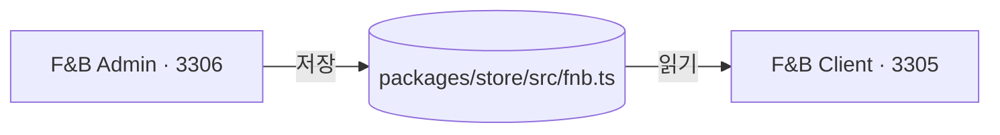

# 고객 화면 연동 — 여기서 정한 값이 어디에 나타나는가

이 저장소에는 서버가 없다. 여기서 저장한 값이 사이트에 나타나는 것은 두 앱이 **같은 모듈을
읽기** 때문이지 통신하기 때문이 아니다.

값을 화면에 박아 두면 고칠 때마다 배포해야 한다. 그래서 **글자로 적어도 되는 것까지 값으로**
둔다 — 브랜드 이름이 그 예다. 한 번 바꿔 봤기 때문에 안다: 국밥 브랜드에서 이 이름으로 옮길 때
화면에 박아 둔 글자가 남는 자리가 실제로 있었다(푸터처럼 아래로 내려가야 보이는 곳).

---

## 대응표

| 사이트 화면 | 값 | 여기서 고치는 화면 |
|---|---|---|
| 홈 — 첫 화면 · 푸터 | `FNB_BRAND` | 설정 > 브랜드 정보 |
| 홈 — 숫자 띠 | `openStores()` · `franchiseCostTotal()` | 등록 > 가맹점 · 창업 > 비용 · 절차 |
| 홈 — 공지 띠 | `orderedFnbNotices()` | 고객센터 > 공지사항 |
| 홈 — 대표 메뉴 | `publicMenuItems()` | 등록 > 메뉴 |
| 홈 — GRAND OPEN | `newestStores()` | 등록 > 가맹점 |
| 홈 — 본사가 하는 것 | `BRAND_POINTS` | (어드민 화면 없음) |
| 홈 — 성장 · 매장별 실적 | `GROWTH_FIGURES` · `STORE_SALES` | (어드민 화면 없음) |
| 브랜드 | `FNB_BRAND` · `openStores()` | 설정 > 브랜드 정보 |
| 메뉴판 · 메뉴 상세 | `MENU_CATEGORIES` · `publicMenuItems()` | 등록 > 메뉴 · 등록 > 메뉴 > 메뉴 카테고리 |
| 인테리어 | `INTERIOR_PLANS` · `INTERIOR_PER_PYEONG` · `INTERIOR_GALLERY` | 창업 > 비용 · 절차 |
| 마케팅 | `MARKETING_CHANNELS` · `postsOfChannel()` | 등록 > 마케팅 |
| 매장안내 | `publicStores()` · `STORE_REGIONS` | 등록 > 가맹점 |
| 창업안내 | `FRANCHISE_COSTS` · `FRANCHISE_STEPS` | 창업 > 비용 · 절차 |
| 창업 상담 신청 | (사이트가 넣고 어드민이 받는다) | 창업 > 문의 내역 |
| 가맹점 개설문의 | `publicFnbFaqs()` `audience = 창업` · `faqTopicsOf()` | 창업 > FAQ |
| 고객센터 — 공지사항 | `orderedFnbNotices()` | 고객센터 > 공지사항 |
| 고객센터 — 자주 묻는 질문 | `publicFnbFaqs()` `audience = 손님` | 고객센터 > FAQ |
| 이용약관 · 개인정보 처리방침 | (아직 원고가 없다) | — |

---

## 걸러지는 것

사이트가 다시 판단하지 않는다. store 의 공개 필터가 한 벌로 거른다.

| 필터 | 거르는 것 |
|---|---|
| `publicMenuItems()` | 내려 둔 메뉴(품절 · 계절) |
| `publicStores()` | 휴점 매장. **준비중은 남긴다** |
| `openStores()` | 준비중까지 뺀 것 — `지금 N곳` 이라 적는 자리가 쓴다 |
| `publicFnbFaqs()` | 숨긴 FAQ |
| `orderedFnbNotices()` | 숨긴 공지. 고정한 것이 위로 |
| `postsOfChannel()` | 숨긴 글. 올린 날이 늦은 것부터 |

이 필터를 화면마다 적지 않는 이유: 새 화면을 만드는 날 그 한 줄을 빠뜨리고, 그러면 내려 둔 것이
그 화면에만 다시 뜬다.

---

## 아직 이어지지 않은 것

정직하게 적는다. 어드민에 화면이 있는데 사이트가 읽지 않는 값이다.

| 값 | 어드민 | 사이트 |
|---|---|---|
| `FNB_BANNERS` | 배너 > 메인 비주얼 (목록 · 상세 · 등록) | **첫 화면이 이 값을 안 읽는다.** 지금 첫 화면은 `FNB_BRAND.tagline` 을 쓴다 |
| `FNB_POPUPS` | 배너 > 팝업 (목록 · 상세 · 등록) | **띄우는 코드가 없다** |

반대로 사이트에 나가는데 어드민에서 못 고치는 값도 둘 있다 — `BRAND_POINTS`(홈의 본사 카드 셋)와
`GROWTH_FIGURES` · `STORE_SALES`(성장 판). 지금은 코드에서 늘린다.
