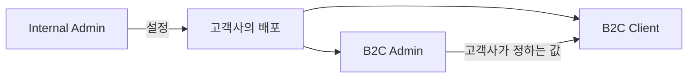

# Deployment Mapping — Internal Admin

> **이 콘솔이 정하는 값이 고객사의 배포 어디에 반영되는지**를 적는다.
> B2C Admin 의 같은 이름 문서(`Admin Mapping`)는 고객 화면과 어드민 사이를 잇는다. 여기는
> 한 층 위다 — **우리와 고객사 사이**를 잇는다.

근거는 `apps/internal-admin/lib/screen-specs.ts` 다. 각 화면 명세의 `admin` 필드가 곧 이
문서의 오른쪽 칸이다.

## 1. 값이 흐르는 길

**두 층이 있다.** 우리가 정하는 것(플랜·권한·연동·도메인)은 고객사의 **배포 자체**를 만들고,
고객사가 정하는 것(상품·배너·공지)은 그 배포 안에서 돈다. 층이 갈리는 자리가 곧 화면이
갈리는 자리다 — 고객사가 만질 수 있는 값은 이 콘솔에 없고, 우리가 정하는 값은 B2C Admin 에 없다.

**이 저장소에는 서버도 API 도 없다.** 실제 배포에 값을 밀어 넣는 일은 여기서 일어나지 않고,
화면은 앱 안의 시드(`lib/data/*`)와 주소의 질의문자열만 읽는다. 도면의 화살표는 **뜻**이지
구현이 아니다. 있지도 않은 API 를 그려 두면 그 도면을 보고 만드는 사람이 서버를 찾는다.

## 2. 화면 → 고객사의 배포

`pages.manifest.ts` 의 22개 전부다. 배포에 나타나지 않는 것은 **`사내 전용`** 으로 적는다.

### 2.1 대시보드

| 화면 | 경로 | 배포에 반영되는 것 |
|---|---|---|
| Dashboard | `/` | `사내 전용` — 여기서 정하는 값이 하나도 없다 |

대시보드는 다른 화면이 만들어 낸 신호를 모아 보내는 자리다. 값을 정하지 않으므로 나갈 것도 없다.

### 2.2 고객사

| 화면 | 경로 | 배포에 반영되는 것 |
|---|---|---|
| Tenants | `/tenants` | **배포 전체** — 여기 등록한 고객사에만 배포가 붙는다 |
| Pipeline | `/tenants/pipeline` | **배포 전체** — 운영 단계로 옮긴 건이 곧 고객 목록이고, 거기서 배포가 붙는다 |
| Activities | `/tenants/activities` | `사내 전용` — 우리가 남기는 기록이다 |
| Contacts | `/tenants/contacts` | `사내 전용` — 우리가 연락할 사람의 목록이다 |
| Churned Tenants | `/tenants/churned` | `사내 전용` — 이미 배포가 내려간 곳이다 |
| Tenant Detail | `/tenants/[tenantId]` | **도메인 · 계정** — 여기 적힌 것이 실제 배포의 값이다 |

파이프라인과 고객 목록이 **같은 자료를 다르게 본다.** 운영 단계의 건이 곧 고객사이므로,
단계를 옮기는 것과 고객사를 등록하는 것은 결국 같은 사실을 말한다. 시드를 두 벌로 두지
않는 이유가 그것이다 — 두 벌이면 같은 고객사가 두 화면에서 다르게 보인다.

### 2.3 구독

| 화면 | 경로 | 배포에 반영되는 것 |
|---|---|---|
| Plans | `/subscriptions/plans` | **고객사 어드민의 메뉴 범위** — 플랜이 켜는 권한만큼만 열린다 |
| Roles | `/subscriptions/roles` | **고객사 어드민의 메뉴** — 꺼진 권한의 메뉴는 그 배포에 아예 없다 |

메뉴를 숨기지 않고 **아예 없게** 하는 이유: 보이는데 눌리지 않는 메뉴는 고장으로 읽힌다.
플랜을 올리면 그때 생긴다.

### 2.4 문의

| 화면 | 경로 | 배포에 반영되는 것 |
|---|---|---|
| Inquiries | `/inquiries` | `사내 전용` — 우리가 답하는 자리다 |

고객사가 보낸 문의는 지금 **이 콘솔 안에서만** 읽고 답한다. 고객사 쪽에서 답을 받아 보는
화면은 아직 없다 — 메일로 답한다. 있는 것처럼 적으면 다음 사람이 찾다가 헤맨다.

### 2.5 연동 — 값이 가장 많이 나가는 갈래

| 화면 | 경로 | 배포에 반영되는 것 |
|---|---|---|
| Integration PG | `/integrations/pg` | **결제 화면** — 여기서 정한 대행사와 수단으로 돈다 |
| Integration OAuth | `/integrations/oauth` | **로그인 화면** — 켠 제공자만 단추로 나타난다 |
| Integration Plugin | `/integrations/plugin` | **배포 전체** — 켠 조각이 고객사 화면에서 바로 돈다 |
| Integration DNS | `/integrations/dns` | **도메인** — 이 값이 들어가야 배포가 자기 주소에서 열린다 |

네 화면이 이 콘솔에 있는 이유는 하나다. **틀리면 고객사 사이트가 통째로 멈추고, 원인을 찾는
것도 우리 몫이 된다.** 고객사가 직접 만지게 두면 키 하나 잘못 넣은 밤에 우리가 불려 나온다.

DNS 만 방향이 다르다 — 우리가 **값을 만들어 주고 확인만** 하고, 등록은 고객사가 자기 도메인
관리 화면에서 한다. 그래서 그 화면에는 저장이 없다.

### 2.6 통계

| 화면 | 경로 | 배포에 반영되는 것 |
|---|---|---|
| Revenue | `/statistics/revenue` | `사내 전용` |
| Members | `/statistics/members` | `사내 전용` |

읽기만 하는 갈래다. 다만 **회원 상한**은 플랜이 정하는 값이라, 여기서 읽은 것이 구독 갈래로
돌아가 다음 계약의 조건이 된다.

### 2.7 결제

| 화면 | 경로 | 배포에 반영되는 것 |
|---|---|---|
| Billing Due | `/billing/due` | `사내 전용` — 고객사에게는 회계가 따로 안내한다 |
| Billing Overdue | `/billing/overdue` | `사내 전용` — 담당자가 직접 연락한다 |

이 콘솔은 청구를 **집행하지 않고 안내만** 한다. 그래서 결제하기 단추가 없고, 여기서 만든
청구가 고객사 화면에 나타나지도 않는다.

### 2.8 설정

| 화면 | 경로 | 배포에 반영되는 것 |
|---|---|---|
| Staff | `/settings/staff` | `사내 전용` — 우리 직원의 계정이다 |
| Notifications | `/settings/notifications` | `사내 전용` — 우리에게 오는 알림이다 |
| Codes | `/settings/codes` | **계약서 · 문의 양식** — 플랜 이름과 분류가 그대로 쓰인다 |

7.1 과 2.2 를 갈래로 나눈 이유가 이 표에 있다. **2.2 는 값이 밖으로 나가고 7.1 은 나가지
않는다.** 같은 `권한` 이라는 말을 쓰지만 반영되는 곳이 다르다.

### 2.9 시스템

| 화면 | 경로 | 배포에 반영되는 것 |
|---|---|---|
| Result | `/result` | `사내 전용` |

## 3. 배포에 나가는 값의 요약

밖으로 나가는 것은 결국 **여섯 가지**다. 나머지는 전부 사내 전용이다.

| 값 | 정하는 화면 | 틀리면 |
|---|---|---|
| 고객사가 존재하는가 | `/tenants` · `/tenants/pipeline` | 배포가 붙을 곳이 없다 |
| 도메인·계정 | `/tenants/[tenantId]` · `/integrations/dns` | 사이트가 열리지 않는다 |
| 무엇이 열리는가 | `/subscriptions/plans` · `/subscriptions/roles` | 쓸 수 있어야 할 메뉴가 없다 |
| 로그인 | `/integrations/oauth` | 아무도 들어가지 못한다 |
| 결제 | `/integrations/pg` | 아무도 사지 못한다 · 실결제면 잘못된 돈이 빠진다 |
| 얹은 조각 | `/integrations/plugin` | 보이지 않는 것이 밖으로 나간다 |

여섯 중 넷이 연동 갈래에 있다. 그 갈래가 이 콘솔에서 가장 조심스러운 자리라는 뜻이고,
화면마다 고객사를 먼저 고르게 하고 고객사를 바꾸면 값을 다시 시작하는 이유도 그것이다.

## 4. 가정

- 이 문서는 **지금 이 앱에 실제로 있는 화면**만 적는다. 있을 법한 화면을 미리 적지 않는다.
- 실제 배포에 값을 밀어 넣는 통로는 **아직 없다.** 프론트엔드 전용이라 저장은 화면 안에서만
  일어나고, 오른쪽 칸은 "이 값이 무엇을 정하는가" 를 뜻한다.
- 고객사 쪽에서 우리 문의에 답을 받아 보는 화면도 없다. 메일로 답한다.
