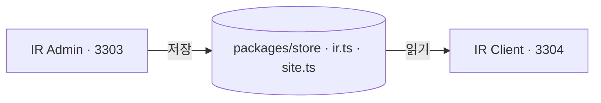

# 고객 화면 연동 — 여기서 정한 값이 어디에 나타나는가

이 저장소에는 서버가 없다. 여기서 저장한 값이 사이트에 나타나는 것은 두 앱이 **같은 모듈을
읽기** 때문이지 통신하기 때문이 아니다.

## 이 콘솔이 두 갈래를 함께 다룬다

값이 두 파일에 나뉘어 있고, 성격이 다르다.

| 파일 | 무엇 | 틀렸을 때 |
|---|---|---|
| `site.ts` | 제품 · 콘텐츠 · 배너 · 설정 | 다시 쓰면 된다 |
| ~~`ir.ts`~~ | ~~공시 · 재무 · 주주 · 자료~~ | **이 콘솔이 더는 안 읽는다** — 화면 열을 지웠다 |

`ir.ts` 를 다루던 화면 열(공시 · 재무 · 주주 · 자료)을 지웠다. 사연은
`lib/navigation/ir-menu.ts` 머리말에 있다. **투자자 사이트는 그 값을 지금도 읽는다** —
다만 저장소 어디에도 고치는 자리가 없다.

---

## 1. 대응표 — 여기서 고치면 사이트가 바뀐다

| 여기서 고치는 화면 | 값 | 사이트 화면 |
|---|---|---|
| 콘텐츠 > 공지사항 | `SITE_NOTICES` | 고객지원 — 공지사항 |
| 콘텐츠 > 뉴스 | `MEDIA_CLIPS` | 고객지원 — 뉴스 |
| 콘텐츠 > FAQ | `SITE_FAQS` | 고객지원 — FAQ |
| 제품 > 목록 · 설정 | `SOLUTIONS` | 제품 · 솔루션 상세 넷 |
| 서비스 > 목록 · 설정 | `SERVICE_DETAILS` | 솔루션 상세 둘(컨설팅 · 인프라) |
| 회사 > 연혁 | `MILESTONES` | 회사소개 · 연혁 |
| 회사 > 특허 및 인증 | `CREDENTIALS` | 회사소개 · 특허 및 인증 |
| 배너 > 팝업 | `SITE_BANNERS` `slot = 팝업` | **모든 화면 위에 뜨는 팝업** |
| 문의 > 설정 | `SITE_INQUIRY_KINDS` · `SITE_REGIONS` | 고객지원 — 문의하기의 고르는 칸 |
| *(메뉴 밖)* `/solutions` | `SITE_SERVICES` | 제품 화면의 서비스 칸 |

문의는 방향이 반대다 — **사이트가 넣고 여기가 받는다**(`SITE_INQUIRIES`).

`(메뉴 밖)` 은 사이드바에 항목이 없어 **주소를 직접 쳐야 열리는** 화면이다. 어느 화면이
그런지는 [Path 정의서](/docs/path) §5 에 표로 있다.

---

## 2. 여기서 고쳐도 사이트가 안 바뀌는 값

저장은 되는데 아무 일도 일어나지 않는다. 올린 사람이 자기가 뭘 잘못했는지 찾게 되는 자리다.

| 여기 화면 | 값 | 왜 |
|---|---|---|
| 설정 > SEO 정보 | `SITE_SEO` | 사이트가 안 읽는다 |
| 설정 > 공급자 정보 | `SITE_SUPPLIER` | 사이트 푸터는 `IR_COMPANY` 를 읽는다. **대표이사 이름이 이미 갈려 있다** |
| 설정 > 이용약관 · 개인정보 처리방침 | `LEGAL_DOCS` | 사이트의 `/terms` · `/privacy` 는 화면이 든 글을 그린다 — **두 벌이다** |
| 설정 > 국문 · 영문 | `LOCALE_PAIRS` | 사이트에 영문 화면이 없다 |
| 회사 > 소개 | `SITE_INTRO` | 사이트 홈의 소개 문단이 이 값을 안 읽는다 |
| 배너 > 메인 비주얼 | `SITE_BANNERS` `slot = 메인 비주얼` | 사이트 첫 화면이 `HERO_SLIDES` 를 그린다 |

**통계 셋은 여기 없다.** 읽기만 하는 화면이라 사이트에 나갈 값이 아니다.

---

## 3. 사이트에 나가는데 **여기에 화면 자체가 없는** 값

| 값 | 사이트 화면 | 여기 |
|---|---|---|
| `DISCLOSURES` | 공시 목록 · 공시 상세 | 화면을 지웠다 |
| `FINANCIALS` · `DIVIDENDS` · `STOCK` | 재무정보 · 배당정보 · 주가정보 | 같음 |
| `MEETINGS` | 주주총회 · 전자투표 | 같음 |
| `OFFICERS` · `SHAREHOLDERS` | 지배구조 | 같음 |
| `IR_DOCUMENTS` · `IR_SCHEDULES` · `SUBSCRIBERS` | 자료실 · IR 일정 · 알림 신청 | 같음 |
| `IR_COMPANY` | **모든 화면의 푸터** · 회사소개 · 오시는 길 | 처음부터 없었다 |
| `HERO_SLIDES` | 홈 첫 화면 | 같음 |
| `DIRECTIONS` | 오시는 길 | 같음 |

**이 표가 이 콘솔의 가장 큰 사실이다.** 사이트에 나가는 값의 절반을 저장소 어디서도 못 고친다.
공시 · 재무 쪽은 원래 목록만 있고 올리는 자리가 없었는데(읽기 전용), 그 목록마저 지웠다.

사이트에서 그 화면들까지 내리기로 하면 그때 `ir.ts` 를 함께 지운다. 지금은 **사이트가 계속
그리므로** 값을 남겨 둔다 — 값을 먼저 지우면 사이트가 빈 표를 그린다.

---

## 4. 되돌릴 수 없는 동작

없다. **공시 게시가 유일한 그런 동작이었고, 그 화면을 지웠다.**

나머지 저장은 전부 다시 쓰면 되는 것이고, 지우기는 목록에서 확인 창을 한 번 지난다.

---

## 5. 걸러지는 것

사이트가 다시 판단하지 않는다. store 의 공개 필터가 한 벌로 거른다.

| 필터 | 거르는 것 |
|---|---|
| `publicDisclosures()` | `작성 중` · `검토 요청`. **`공시됨` 과 `정정` 만 나간다. 주소로도 안 열린다** |
| `publicSiteNotices()` | 숨긴 공지. 고정한 것이 위로 |
| `publicMediaClips()` | 숨긴 뉴스 |
| `publicSiteFaqs()` | 숨긴 FAQ |
| `publicCredentials()` | 숨긴 특허·인증 |
| `publicSolutions()` | 내려 둔 제품 |
| `liveSitePopups()` | 기간 밖이거나 사람이 내려 둔 팝업 |

이 필터를 화면마다 적지 않는 이유: 새 화면을 만드는 날 그 한 줄을 빠뜨리고, 그러면 내려 둔
것이 그 화면에만 다시 뜬다.

---

## 6. 팝업이 걸리는 규칙

`scheduleState()` 가 **날짜로** 판정한다. 사람이 켜고 끄는 것은 `숨김` 하나뿐이다 — 행사가
끝난 다음 날 아무도 안 끄기 때문이다. B2C 배너와 **같은 함수**를 쓴다.

| 상태 | 뜻 |
|---|---|
| `노출 중` | 지금 걸린다 |
| `예정` | 시작일이 아직 안 됐다 |
| `종료` | 종료일이 지났다 |
| `숨김` | 사람이 내려 두었다. 기간과 상관없다 |

- 걸린 것이 여럿이어도 **한 번에 하나만** 뜬다. 닫으면 다음 것이 뜬다.
- **본문이 필수**다. 제목만 뜬 팝업은 무슨 일인지 안 알려 주는 상자가 된다.
- 자리를 고르는 칸을 두지 않았다 — 여기 뜨는 것이 휴무·처리방침 개정처럼 읽혀야 뜻이 있는
  고지뿐이라, 모서리에 조용히 서는 자리를 만들면 그 자리에 놓인 팝업은 안 읽힌다.
- `오늘 하루 보지 않기` 기록은 **그 사람의 브라우저에만** 있다. 여기서 볼 수 없다.
