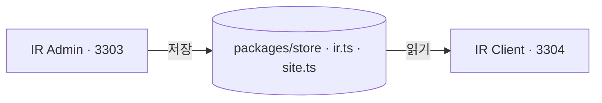

# 어드민 연동 — 이 사이트가 읽는 값이 어디서 오는가

이 사이트에는 서버가 없다. 어드민에서 저장한 값이 여기 나타나는 것은 두 앱이 **같은 모듈을
읽기** 때문이지 통신하기 때문이 아니다.

## 이 사이트가 다른 둘과 다른 점

쇼핑몰과 브랜드 사이트는 **사는 사람**이 오고, 여기는 **투자자와 주주**가 온다. 그 차이가
문서에도 남아야 한다 — 여기 화면이 틀리면 잘못 산 물건이 아니라 **공시 위반**이 된다.

그래서 이 문서는 "어디를 고치면 되나" 만 적지 않고 **못 고치는 값**과 **어디에도 안 나가는
값**을 같은 무게로 적는다. 있는 척하는 표는 그것을 믿고 고치러 간 사람을 헤매게 한다.

---

## 1. 어드민에서 고치면 사이트가 바뀌는 값

| 이 사이트의 화면 | 읽는 값 | 고치는 어드민 화면 |
|---|---|---|
| 모든 화면 — 팝업 | `liveSitePopups()` | 배너 > 팝업 |
| 회사소개 · 연혁 | `MILESTONES` | 회사 > 연혁 |
| 회사소개 · 특허 및 인증 | `publicCredentials()` | 회사 > 특허 및 인증 |
| 제품 (`/products`) | `publicSolutions()` · `SITE_SERVICES` · `SERVICE_DETAILS` | 제품 > 목록 · 서비스 > 목록 · `/solutions` † |
| 솔루션 상세 여섯 | `findOffering()` | 제품 > 목록 · 서비스 > 목록 |
| 고객지원 — 공지사항 | `publicSiteNotices()` · `SITE_NOTICE_GROUPS` | 콘텐츠 > 공지사항 |
| 고객지원 — 뉴스 | `publicMediaClips()` | 콘텐츠 > 뉴스 |
| 고객지원 — FAQ | `publicSiteFaqs()` · `FAQ_GROUPS` | 콘텐츠 > FAQ |
| 고객지원 — 문의하기 | `SITE_INQUIRY_KINDS` · `SITE_REGIONS` | 문의 > 설정 |

일곱 자원이다. **나머지는 아래 두 표에 있다.**

† 표가 붙은 것은 **어드민 사이드바에 없는 화면**이다. 주소를 직접 쳐야 열린다
(`apps/ir-admin/docs/path.md` §5).

**공시가 이 표에서 빠졌다.** 어드민의 공시 · 재무 · 주주 · 자료 화면 열이 지워졌다 — 이제
공시 게시 상태를 바꾸는 자리가 저장소 어디에도 없다.

---

## 2. 사이트에는 나가는데 어드민에서 못 고치는 값

정직하게 적는다. 이 목록이 이 한 쌍의 가장 큰 구멍이다.

**이 목록이 커졌다.** 어드민에서 공시 · 재무 · 주주 · 자료 화면 열을 지우면서, 그 값들이
전부 여기로 내려왔다.

| 값 | 사이트 자리 | 어드민 |
|---|---|---|
| `IR_COMPANY` 전부 | **모든 화면의 푸터** · 회사소개 · 오시는 길 | 처음부터 화면 없음 |
| `DISCLOSURES` | 공시 목록 · 공시 상세 | **화면을 지웠다** |
| `FINANCIALS` · `DIVIDENDS` · `STOCK` | 재무정보 · 배당정보 · 주가정보 | 같음 |
| `MEETINGS` | 주주총회 · 전자투표 | 같음 |
| `OFFICERS` · `SHAREHOLDERS` | 지배구조 | 같음 |
| `IR_DOCUMENTS` · `IR_SCHEDULES` | 자료실 · IR 일정 | 같음 |
| `SUBSCRIBERS` | 알림 신청 | 같음 |
| `DIRECTIONS` | 오시는 길 | 처음부터 화면 없음 |
| `HERO_SLIDES` | 홈 첫 화면 | 처음부터 화면 없음 — 배너 > 메인 비주얼과 **안 이어져 있다**(§4) |
| `SUPPORT_CATEGORIES` | 알림 신청 | 처음부터 화면 없음 |

`IR_COMPANY` 가 맨 위인 이유: **모든 화면의 푸터가 그 값을 그린다.** 대표이사가 바뀌는 날
고칠 자리가 어드민에 없고, 저장소 안에서 이미 `SITE_SUPPLIER.ceo` 와 갈려 있다.

지운 열 화면은 원래도 **목록만 있고 올리는 자리는 없었다**(읽기 전용). 그러니 이 표에서
바뀐 것은 `못 고친다` 가 `볼 수도 없다` 가 된 것이다. 이 화면들까지 사이트에서 내리기로 하면
그때 `ir.ts` 를 함께 지운다.

---

## 3. 어드민에만 있고 사이트에 안 나가는 값

반대쪽 구멍이다. 저장은 되는데 아무 일도 일어나지 않는다.

| 값 | 어드민 화면 |
|---|---|
| `SITE_SEO` | 설정 > SEO 정보 |
| `SITE_SUPPLIER` | 설정 > 공급자 정보 |
| `LEGAL_DOCS` | 설정 > 이용약관 · 개인정보 처리방침 |
| `SITE_INTRO` | 회사 > 소개 |
| `LOCALE_PAIRS` | 설정 > 국문 · 영문 |
| `PAGE_VISITS` · `VISIT_TREND` | 통계 셋 (읽기 전용이라 정상) |

`LEGAL_DOCS` 가 특히 걸린다 — 사이트의 `/terms` 와 `/privacy` 는 화면이 들고 있는 글을
그리고, 어드민은 따로 원고를 갖고 있다. **두 벌이라 어느 쪽이 내건 약관인지 화면으로는 알 수
없다.**

---

## 4. 걸러지는 것

사이트가 다시 판단하지 않는다. store 의 공개 필터가 한 벌로 거른다.

| 필터 | 거르는 것 |
|---|---|
| `publicDisclosures()` | `작성 중` · `검토 요청`. **`공시됨` 과 `정정` 만 나간다** |
| `publicSiteNotices()` | 숨긴 공지. 고정한 것이 위로 |
| `publicMediaClips()` | 숨긴 뉴스 |
| `publicSiteFaqs()` | 숨긴 FAQ |
| `publicCredentials()` | 숨긴 특허·인증 |
| `publicSolutions()` | 내려 둔 제품 |
| `liveSitePopups()` | 기간이 아직 안 됐거나 지난 것 · 사람이 내려 둔 것 |

공시는 **주소로도 안 열린다.** 다른 자원은 상세를 주소로 열 수 있게 두지만 공시만 막는다 —
나가지 않은 공시가 주소로 읽히면 그것이 곧 미공개 정보 유출이다.

---

## 5. 팝업이 걸리는 규칙

`scheduleState()` 가 **날짜로** 판정한다. B2C 배너와 **같은 함수**를 쓴다 — 같은 물음에 두
벌의 답이 있으면 갈래마다 자정 언저리의 셈이 달라지고, 그 차이는 아무도 재현하지 못한다.

| 상태 | 뜻 |
|---|---|
| `노출 중` | 지금 걸린다. `liveSitePopups()` 가 이것만 넘긴다 |
| `예정` | 시작일이 아직 안 됐다 |
| `종료` | 종료일이 지났다 |
| `숨김` | 사람이 내려 두었다. 기간과 상관없다 |

- **한 번에 하나만** 띄운다. 앞의 것을 닫으면 다음 것이 뜬다.
- 자리는 **가운데 하나뿐**이다. 여기 뜨는 것이 휴무·처리방침 개정처럼 읽혀야 뜻이 있는
  고지뿐이라, 모서리에 조용히 서는 자리를 만들면 그 자리에 놓인 팝업은 안 읽힌다.
- **본문이 필수**다. 제목만 뜬 팝업은 무슨 일인지 안 알려 주는 상자가 된다.
- `오늘 하루 보지 않기` 기록은 **그 사람의 브라우저에만** 있다. 어드민에서 볼 수 없다.

**첫 화면 배너(`메인 비주얼`)는 아직 안 이어져 있다.** 어드민 배너 > 메인 비주얼이 값을
받고 있는데 사이트는 `HERO_SLIDES` 를 그린다. 팝업만 메웠다.

---

## 6. 주가 숫자를 손으로 못 넣는 것은 구멍이 아니다

주가 입력칸을 두지 않은 것은 **뜻한 것**이었다. 사람이 넣을 수 있게 두면 오타 하나가 투자자
화면의 시세가 되고, 그것을 바로잡는 일은 정정 공시가 된다. 사이트는 **지연 시세임을 항상
표시**한다.

`FINANCIALS` · `MEETINGS` 같은 값에 편집 화면이 없는 것은 이와 다르다 — 그쪽은 **안 만든
것**이고, 지금은 목록 화면마저 지워졌다.
