# ir-client-a — 화면 사진

`pnpm pages:shoot -- --app=ir-client-a` 로 다시 찍는다. 폴더는 찍을 때마다 비우고 새로 채운다.

너비 1440px · 화면 전체 · JPEG

사진 파일은 `apps/ir-client-a/public/pages/` 에 있다 — 웹에서 `/docs/pages` 로도 볼 수 있게 하려면 그 아래여야 한다.

| 화면 id | 이름 | 주소 | 사진 |
|---|---|---|---|
| `home` | Home | `/` | 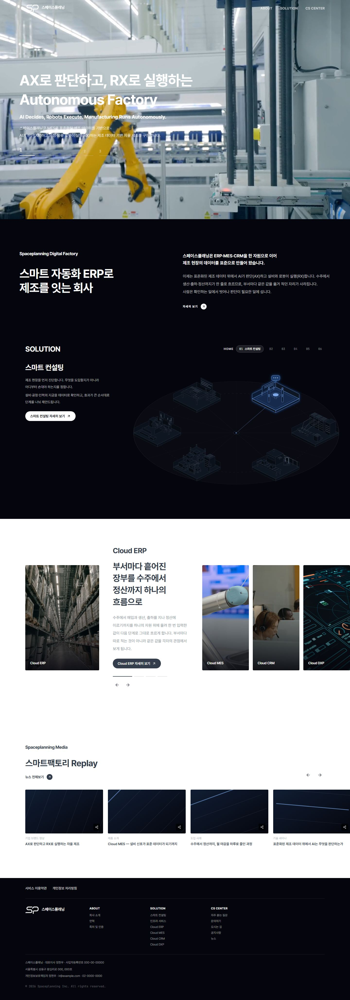 |
| `about` | About | `/about` | 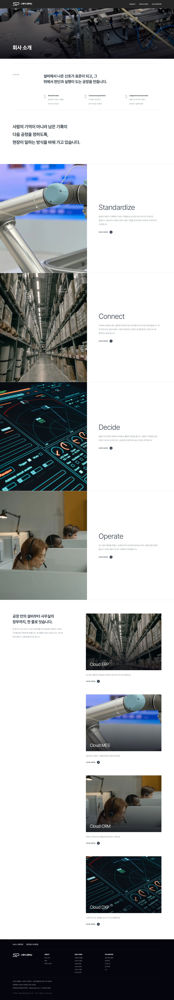 |
| `about-history` | History | `/about/history` | 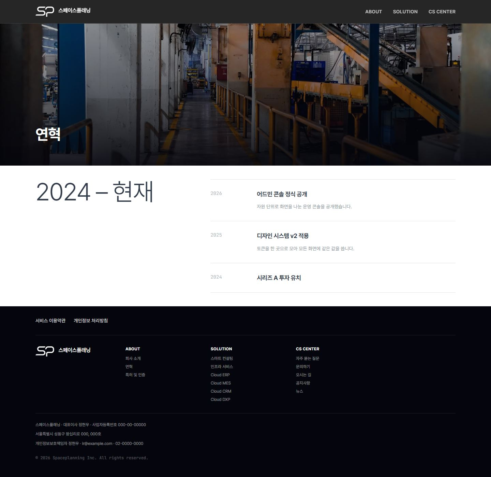 |
| `about-certifications` | Certifications | `/about/certifications` | 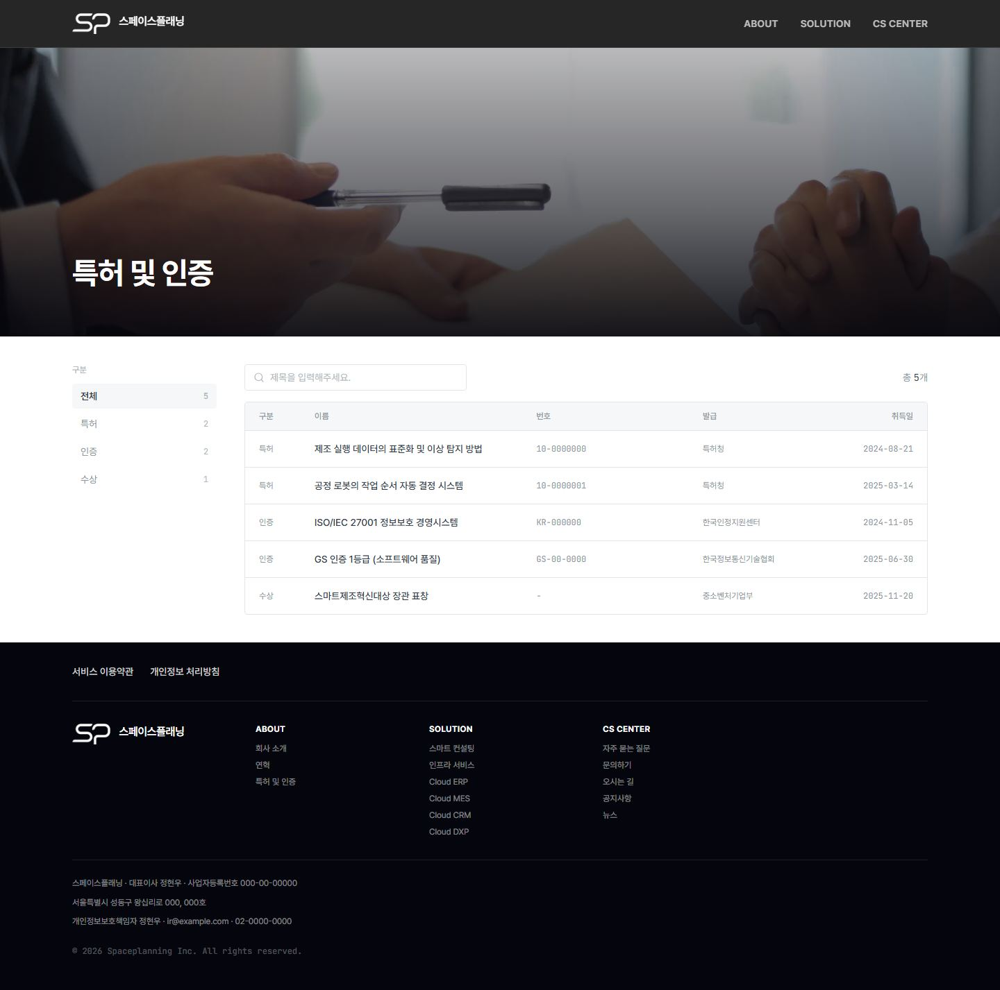 |
| `about-certifications-detail` | Certification Detail | `/about/certifications/[credentialId]` | 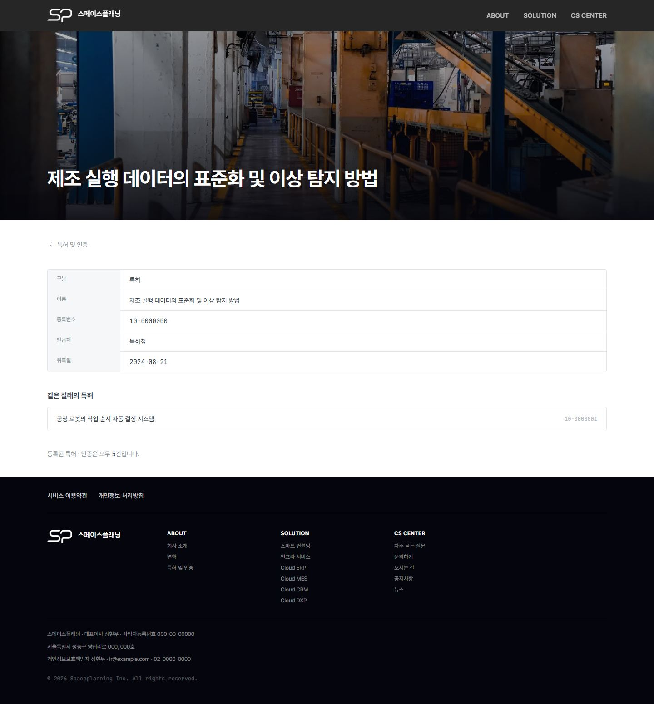 |
| `solutions-consulting` | Smart Consulting | `/solutions/consulting` | 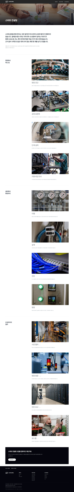 |
| `solutions-infra` | Infra Service | `/solutions/infra` | 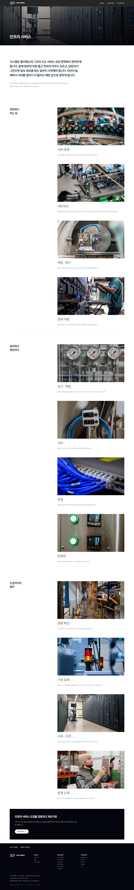 |
| `solutions-mes` | Cloud MES | `/solutions/mes` | 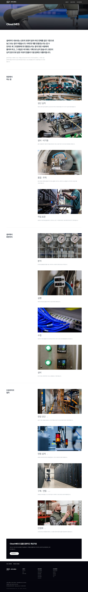 |
| `solutions-erp` | Cloud ERP | `/solutions/erp` | 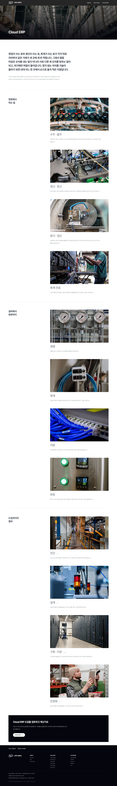 |
| `solutions-crm` | Cloud CRM | `/solutions/crm` | 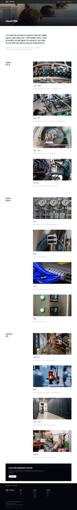 |
| `solutions-dxp` | Cloud DXP | `/solutions/dxp` | 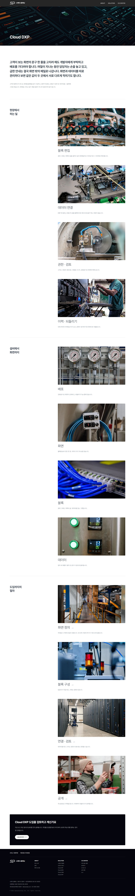 |
| `products` | Products | `/products` | 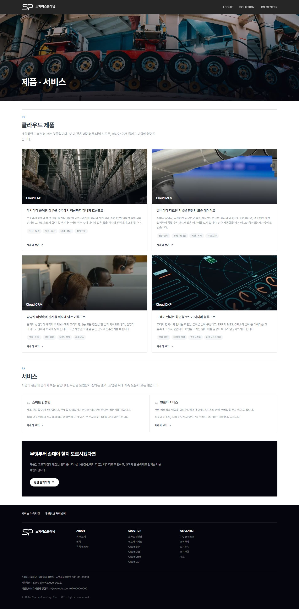 |
| `support-contact` | Contact | `/support/contact` | 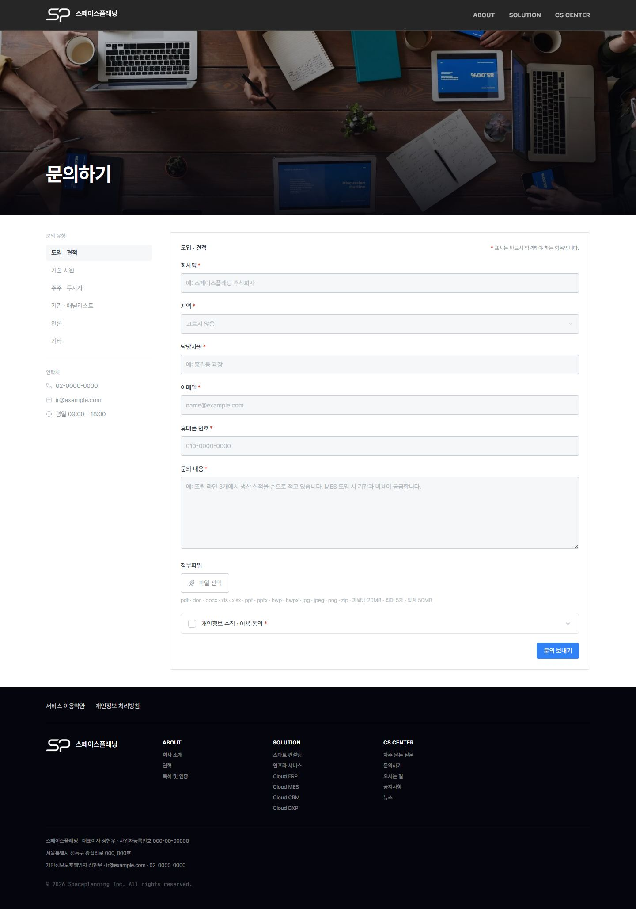 |
| `support-notices` | Notices | `/support/notices` | 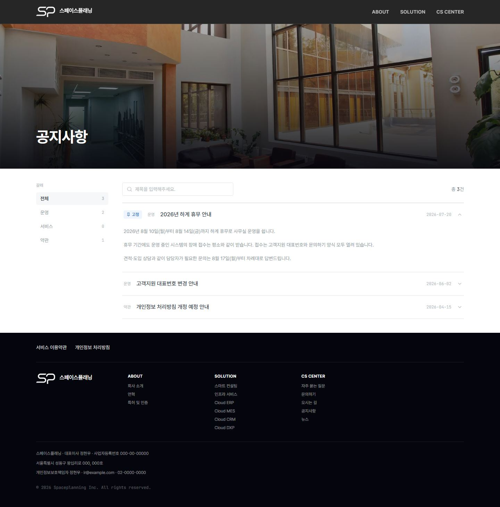 |
| `support-news` | Support News | `/support/news` | 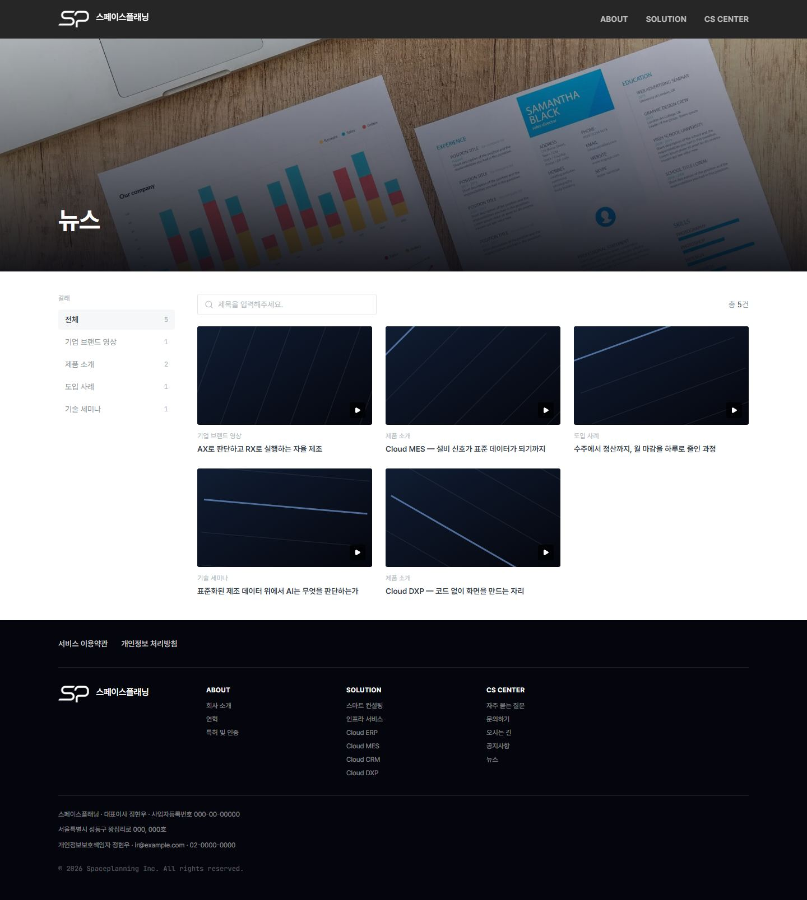 |
| `support-faq` | FAQ | `/support/faq` | 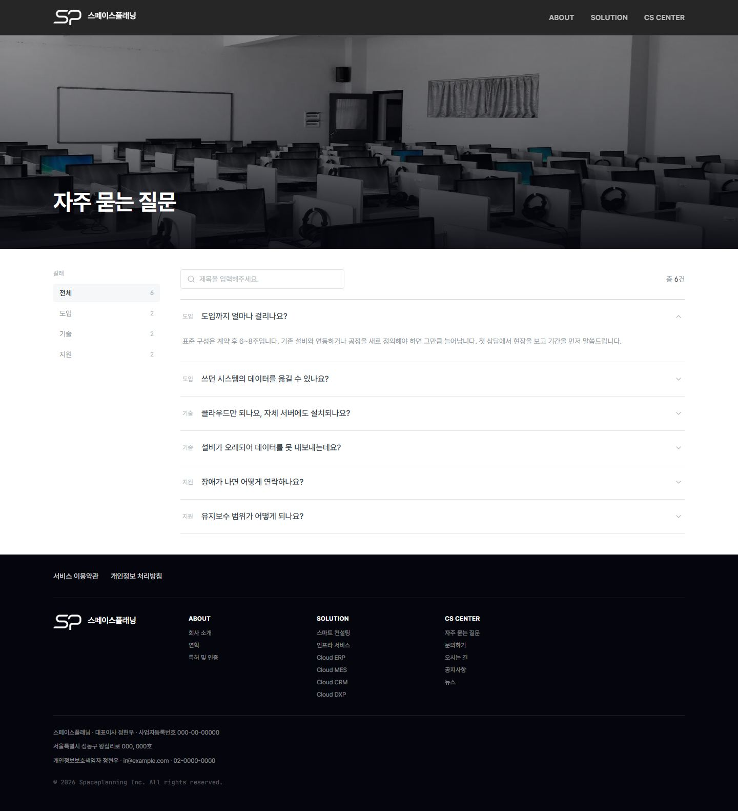 |
| `support-directions` | Directions | `/support/directions` | 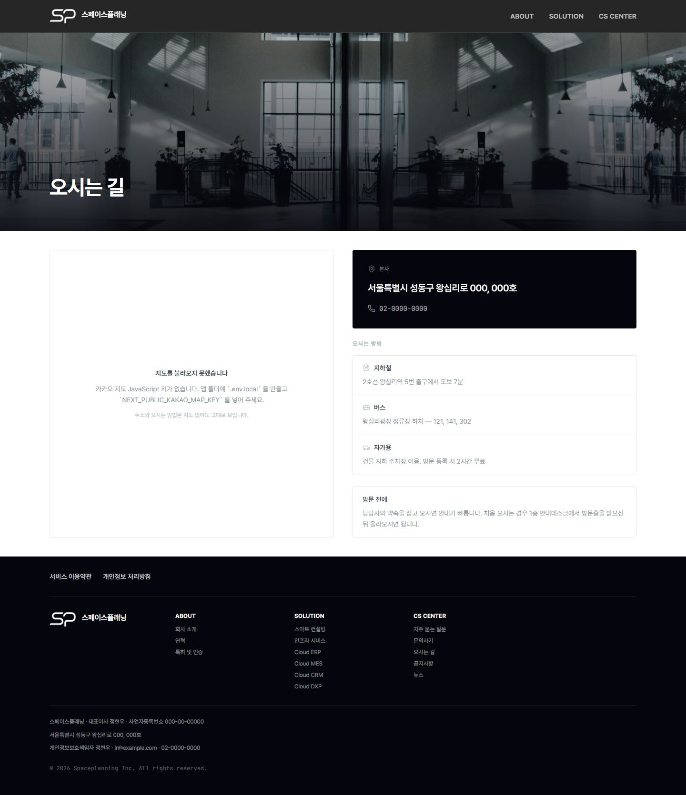 |
| `terms` | Terms | `/terms` |  |
| `privacy` | Privacy | `/privacy` | 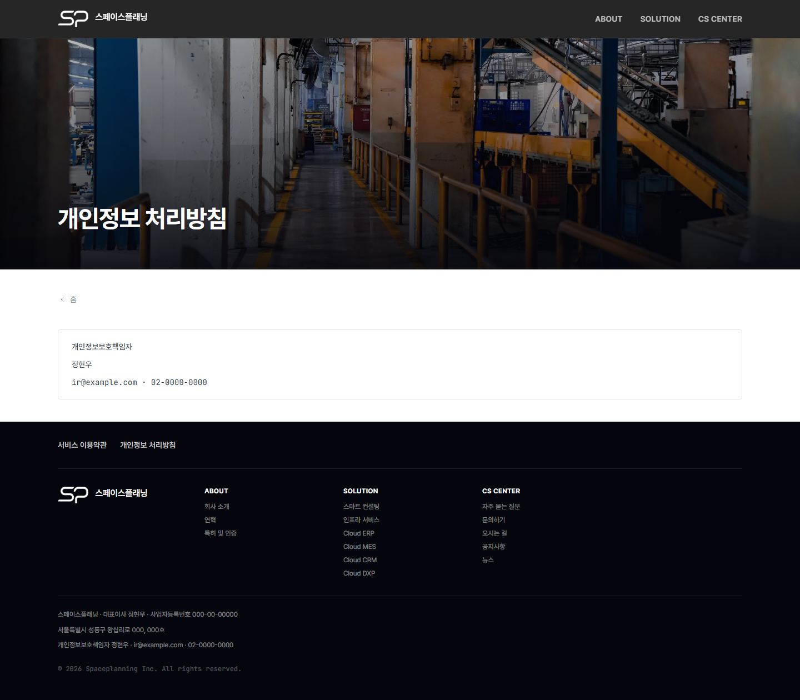 |
