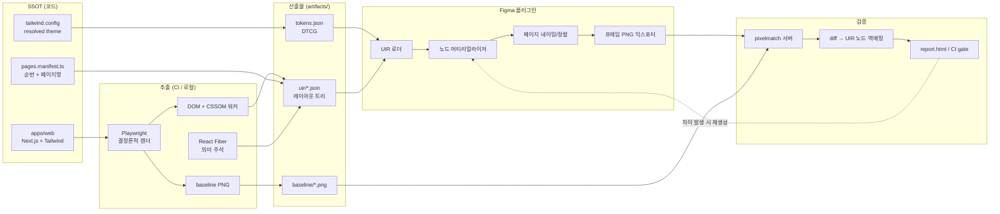

# Code-as-SSOT → Figma 디자인 싱크 아키텍처

> 상태: 구현 진행 중 (v0.3) · 대상 요구사항: 1.1, 1.2
> 명세 문서: [docs/spec/](../spec/README.md) — Path · 명명규칙 · Flow · IA · 컴포넌트 · 디자인 시스템 · 기능 · 비기능
> 스택 전제: Next.js (App Router) + React + Tailwind CSS
> 싱크 판정 기준: **수치 검증(허용오차 0) + 픽셀 검증(글리프 AA 잔차만 허용)** — §9

---

## 0. 요구사항 해석

| ID | 원문 | 설계상 해석 |
|----|------|-------------|
| 1.1 | 홈페이지 UI/UX를 만들면 그 Front-End 코드를 기반으로 Figma 플러그인으로 말아올려(SSOT 구조) Figma에서 그대로 구현 | **프론트엔드 코드가 유일한 진실 공급원(SSOT)**. Figma는 파생 산출물이며 역방향(Figma→코드) 편집은 소스에 반영되지 않는다. |
| 1.2 | 디자인 싱크률 100% | **(A) 수치 검증** — 모든 노드의 좌표·크기·색·타이포 속성이 UIR과 허용오차 0으로 일치. **(B) 픽셀 검증** — 글리프 안티에일리어싱 잔차를 제외한 전 영역 diff = 0. 텍스트는 편집 가능한 TextNode로 유지한다. (§7, §9) |
| 1.2 | Figma 내 페이지가 `1. Index` 형태로 정렬 | Figma **Page** 이름 = `{순번}. {페이지명}`, 페이지 목록이 순번 오름차순으로 물리 정렬. |

### 핵심 설계 판단

디자인 SSOT를 둘 수 있는 위치는 두 가지다.

- **(A) 별도 스펙 문서가 원본** — 코드와 Figma가 각각 스펙을 해석 → 두 해석이 어긋나면 싱크가 깨진다.
- **(B) 렌더된 코드가 원본** — 실제 브라우저가 계산한 최종 레이아웃을 추출 → Figma가 그것을 재현.

**요구사항 1.2(픽셀 100%)를 만족할 수 있는 것은 (B)뿐이다.** Tailwind 유틸리티, 캐스케이드, 폰트 메트릭, 서브픽셀 반올림이 만들어내는 최종 기하는 어떤 수기 스펙으로도 보장할 수 없다. 따라서 SSOT의 물리적 실체는 **"실행 중인 앱의 계산된 레이아웃 트리"** 이다.

단, 순수 (B)는 의미론(컴포넌트 정체성, 변형, Auto Layout)을 잃는다. 그래서 본 설계는 **기하(브라우저 계산값) + 의미(React 컴포넌트 트리)를 하나의 중간표현으로 병합**한다. 이 중간표현을 **UIR (UI Intermediate Representation)** 이라 부른다.

---

## 1. 전체 파이프라인



파이프라인은 **단방향**이다. Figma에서의 수정은 다음 실행 시 덮어써진다(의도된 동작).

---

## 2. SSOT 레이어 구조

SSOT는 단일 파일이 아니라 **생성 규칙이 고정된 4개 레이어**다. 모두 생성물이며 수기 편집 금지.

### L0 — 토큰 (`artifacts/tokens/tokens.json`) — 구현 완료

Tailwind v4 의 `@theme` 는 CSS 커스텀 프로퍼티로 컴파일된다. 따라서 설정 파일을 파싱하지 않고
**실행 중인 앱의 `getComputedStyle(:root)` 에서 `--*` 를 읽는다** — "브라우저 계산값이 진실"이라는
이 프로젝트의 원칙이 토큰 레이어에도 그대로 적용된다.

```jsonc
{
  "color": {
    "brand-500": {
      "$type": "color",
      "$value": "#3b5bfd",
      "$extensions": { "com.winpilot.cssVar": "--color-brand-500", "com.winpilot.source": "project" }
    },
    "canvas": {
      "$type": "color",
      "$value": "#ffffff",
      "$extensions": {
        "com.winpilot.raw":   { "light": "#fff", "dark": "#090a0d" },
        "com.winpilot.modes": { "light": "#ffffff", "dark": "#090a0d" }
      }
    }
  },
  "fontSize":  { "2xl": { "$type": "dimension", "$value": { "value": 24, "unit": "px" } } },
  "lineHeight": { "text-2xl": { "$type": "number", "$value": 1.3333333333333333 } }
}
```

구현상의 판단 세 가지:

1. **색 변환을 브라우저에게 시킨다.** Tailwind 기본 팔레트는 oklch 로 정의되어 Chromium 이 `lab(...)`
   으로 계산해 돌려준다. 이런 최신 색 문법을 JS 로 파싱하면 파서를 하나 더 유지해야 하고, 그 파서가
   브라우저와 다르게 반올림하는 순간 픽셀 검증이 깨진다. 대신 **1×1 캔버스에 실제로 칠하고 픽셀을 읽는다** —
   결과는 정의상 화면에 칠해지는 그 sRGB 8bit 이고, baseline PNG 와 정밀도가 같다.
2. **단위 없는 비율도 브라우저가 계산한다.** `--text-sm--line-height: calc(1.25 / .875)` 같은 값은
   `font-size:100px` 프로브의 `line-height` 에 대입해 계산된 px 를 100으로 나눠 얻는다. calc 계산기를 만들지 않는다.
3. **값은 브라우저, 소유권은 소스.** 우리 디자인 시스템 토큰과 Tailwind 기본 팔레트 잔재를 구분하기 위해
   `globals.css` 의 `@theme static` 블록에 선언된 이름만 정적으로 읽어 `source: 'project'` 로 태깅한다.

> `@theme static` 을 쓴 이유: Tailwind v4 는 **사용된 토큰만** `:root` 에 남긴다(트리셰이킹). 그대로 두면
> 아직 어떤 페이지도 쓰지 않은 브랜드 색이 토큰 파일과 Figma Variables 에서 통째로 빠져,
> 디자인 시스템이 페이지 구축 순서에 따라 흔들린다. 우리 네임스페이스만 `static` 으로 고정한다.

Figma 측 대응: Variables 컬렉션 + Text Style + Effect Style 로 임포트 (Phase 3).
`com.winpilot.modes` 가 있는 토큰은 Figma Variable 의 Light/Dark 모드로 매핑한다.

> ⚠️ **바인딩 규칙**: Figma Variable 바인딩은 *해석된 값이 UIR의 실측값과 정확히 일치할 때만* 적용한다. 일치하지 않으면 raw 값을 쓰고 리포트에 `token-drift`로 기록한다. 토큰 재사용성보다 픽셀 정확도가 우선한다.

### L1 — 컴포넌트 레지스트리 (`artifacts/components.json`)

SWC/Babel 플러그인이 빌드 시 각 컴포넌트 루트 DOM에 `data-ssot-cid` (컴포넌트 ID), `data-ssot-variant` (직렬화된 variant props)를 주입한다. 추출기가 이를 읽어 UIR 노드에 의미 태그를 붙인다.

용도: Figma Component / ComponentSet 생성, Auto Layout 추론 힌트, diff 발생 시 책임 컴포넌트 특정.

`cid` 값은 임의로 정하지 않고 **기능 레지스트리에서 파생**된다 — `client/product.create` 형태로
뷰와 Feature ID 를 담으므로, diff 리포트가 "어느 뷰의 어느 기능"까지 지목한다.
규칙: [명명규칙 정의서 §2.3](../spec/02-naming-convention.md), [컴포넌트 정의서 §5.5](../spec/05-component.md)

### L2 — 페이지 매니페스트 (`apps/web/pages.manifest.ts`)

```ts
// 페이지는 이후 구축하는 대로 여기에 등록한다. 초기값은 비어 있다.
export const pages: PageSpec[] = [
  // { order: 1, id: 'index', name: 'Index', route: '/' },
];

// 확정
export const breakpoints: BreakpointSpec[] = [
  { id: 'desktop', label: 'Desktop', width: 1440 },
  { id: 'tablet',  label: 'Tablet',  width: 768  },
  { id: 'mobile',  label: 'Mobile',  width: 375  },
];
```

요구사항 1.2의 페이지 순번/이름이 여기서 결정된다. **Figma 페이지명은 이 파일 외의 어떤 것도 참조하지 않는다.**

**등록 워크플로** — 페이지를 하나 만들 때마다:

1. `apps/web/app/{route}/page.tsx` 구현
2. `pages.manifest.ts` 에 `{ order, id, name, route }` 한 줄 추가
3. `pnpm ssot:extract && pnpm ssot:verify` → Figma에 `{order}. {name}` 페이지가 생성/갱신됨

**미등록 라우트 가드**: 추출기가 Next.js 라우트 매니페스트를 읽어 매니페스트에 없는 라우트를 발견하면 **경고 후 실패**한다. 페이지를 만들고 등록을 잊는 사고를 구조적으로 막는다(`--allow-unregistered` 로 임시 우회 가능).

`order` 재배열은 숫자만 고치면 되고, Figma 페이지는 `pluginData` 로 추적되므로 순번이 바뀌어도 중복 생성되지 않는다 (§8).

### L3 — UIR 스냅샷 (`artifacts/uir/{pageId}@{bpId}.json`)

파이프라인의 실질적 SSOT 산출물. 브라우저가 계산한 최종 상태.

---

## 3. UIR 스키마

`packages/uir`에 zod 스키마 + TS 타입으로 정의하고 `schemaVersion`으로 버저닝한다. 추출기와 플러그인이 이 패키지를 **공유 의존**하므로 스키마 변경 시 양쪽이 동시에 깨진다(= 조용한 불일치가 불가능).

```ts
type UIRDocument = {
  schemaVersion: '1.0';
  page: { id: string; order: number; name: string; route: string };
  breakpoint: { id: string; label: string; width: number };
  viewport: { width: number; height: number; dpr: 1 };
  fonts: FontRef[];              // 사전 로드 대상
  root: UIRNode;
  capture: { commit: string; builtAt: string; extractorVersion: string };
};

type UIRNode = {
  id: string;                    // 안정적 경로 해시 (재실행 시 동일)
  tag: string;                   // div / h1 / img / svg / ::before ...
  cid?: string;                  // data-ssot-cid — 컴포넌트 정체성
  variant?: Record<string, string>;

  // 기하 — 뷰포트 기준 절대좌표 (float, 반올림 금지)
  rect: { x: number; y: number; w: number; h: number };
  transform?: Matrix2x3;         // rotate/scale/translate 합성
  paintIndex: number;            // CSS 페인팅 순서 (DOM 순서 아님)

  // 스타일
  fills: Paint[];                // solid / linear / radial / angular / image
  strokes?: StrokeSpec;          // 사면 개별 두께·색
  radius: [number, number, number, number] | 'elliptical';
  effects: Effect[];             // shadow / inner-shadow / layer-blur / bg-blur
  opacity: number;
  blendMode: BlendMode;
  clip: boolean;                 // overflow:hidden

  // 텍스트
  text?: {
    runs: TextRun[];             // 스타일이 다른 구간별 분리
    align: 'LEFT'|'CENTER'|'RIGHT'|'JUSTIFIED';
    lineHeightPx: number;        // % 아닌 px로 고정
    letterSpacingPx: number;
    lineBoxes: Rect[];           // 브라우저가 계산한 실제 줄 박스 (검증용)
  };

  // 이미지 / 벡터
  image?: { hash: string; scaleMode: 'FILL'|'FIT'|'CROP'; transform?: Matrix2x3 };
  svg?: string;                  // outerHTML

  // 폴백
  fallback?: { reason: string; rasterHash: string };  // §6 참조

  children: UIRNode[];
};
```

### 설계 포인트

- **절대좌표 우선.** Auto Layout은 픽셀 정확도의 적이다(Figma의 레이아웃 재계산이 브라우저와 미세하게 다름). 기본 모드는 절대 배치이고, Auto Layout은 §7의 `editable` 모드에서만 **기하가 바뀌지 않음이 검증된 경우에 한해** 적용한다.
- **`paintIndex`**: Figma의 z-순서는 children 배열 순서(뒤가 위)뿐이다. CSS의 stacking context / `z-index` / `position` / `opacity<1` / `transform` 이 만드는 페인팅 순서를 추출기가 미리 계산해 평탄한 정수로 굽는다. 플러그인은 이 값으로만 정렬한다.
- **반올림 금지.** 소수점 좌표를 그대로 보존한다. 반올림은 diff의 최대 원인이다.
- **`id`는 재실행 안정성**을 가진다(태그+인덱스 경로 해시). 이래야 diff 리포트가 실행 간 비교 가능하다.

---

## 4. 추출기 (`tools/extractor`)

Playwright + Chromium.

### 결정론 확보 (이게 없으면 픽셀 검증이 무의미)

| 항목 | 처리 |
|------|------|
| DPR | `deviceScaleFactor: 1` 고정 (Figma 익스포트 1x와 정합) |
| 애니메이션 | `prefers-reduced-motion: reduce` + `*{animation:none!important;transition:none!important}` 주입 |
| 폰트 | 셀프호스팅 woff2를 사전 로드, `await document.fonts.ready` 후 캡처 |
| 스크롤바 | `::-webkit-scrollbar{display:none}` (레이아웃 폭 오염 방지) |
| 시간/난수 | `Date`, `Math.random` 고정 시드로 스텁 |
| 지연 로딩 | 전체 스크롤 후 top 복귀 → `networkidle` + 이미지 `decode()` 대기 |
| 커서/포커스 | 포커스 링 제거, hover 상태 없음 |

### 워킹 알고리즘

1. `document.documentElement`부터 DFS.
2. 각 요소: `getBoundingClientRect()` + `getComputedStyle(el)` + `getComputedStyle(el,'::before'/'::after')`.
3. 텍스트 노드는 `Range.getClientRects()`로 줄 박스와 런 경계 확보.
4. `visibility:hidden`, `display:none`, `w*h===0` 이고 그림자/보더 없는 노드는 프루닝.
5. 스택킹 컨텍스트 트리를 별도 구성 → `paintIndex` 부여.
6. 이미지/폰트/SVG는 콘텐츠 해시로 `artifacts/assets/{hash}` 에 저장, UIR에는 해시만.
7. 동일 실행에서 `page.screenshot({ fullPage: true })` → `artifacts/baseline/{pageId}@{bpId}.png`.

**UIR과 baseline PNG는 반드시 동일 브라우저 세션에서 생성한다.** 별도 실행 시 폰트 래스터라이저 상태 차이로 diff가 새어나온다.
같은 이유로 **폴백 래스터는 baseline PNG 를 잘라내서 만든다** — 따로 스크린샷을 찍지 않으므로 그 영역의 diff 가 정의상 0 이다.

### 구현상의 판단 (Phase 2)

| 항목 | 결정 | 이유 |
|---|---|---|
| 뷰포트 높이 | **900px 고정**, 스크롤 0 | 스크롤이 0 이면 `getBoundingClientRect()` 가 곧 문서 좌표다. `100vh` 가 실행마다 흔들리지 않도록 높이를 못 박는다. |
| 회전·기울임 변환 | 폴백 래스터 | `getBoundingClientRect()` 는 이미 변환된 축정렬 박스라, 이동·확대만 있으면 그대로 쓰면 된다. 회전이 섞이면 원본 박스 역산 오차가 커진다. |
| 그라디언트 | 폴백 래스터 | Figma `gradientTransform` 매핑을 실제 Figma 에서 검증하기 전에는 네이티브로 내보내지 않는다. 검증 불가능한 행렬 연산은 조용히 틀린 파이프라인을 만든다. Phase 3 에서 승격. |
| `::before` / `::after` | 폴백 래스터 | DOM 에 없어 기하를 잴 수 없다. |
| 텍스트 블록 | 문단 하나 = TextNode 하나 | 인라인 자손이 배경·테두리를 가지면 그 칠만 별도 노드로 텍스트 아래에 깔아 순서를 지킨다. |
| `rounded-full` | `min(w,h)/2` 로 클램프 | Tailwind 는 `calc(infinity * 1px)` 로 컴파일되어 33554400px 같은 값이 나온다. 브라우저가 실제로 그리는 값으로 정규화한다. |
| 페인팅 순서 | 정적(-1) → 위치(0) → z-index 값 | 형제를 이 순서로 정렬해 `paintIndex` 를 굽는다. 음수 z-index 가 부모 배경보다 아래로 가는 경우는 Figma 가 표현하지 못한다(알려진 한계). |

---

## 5. CSS → Figma 매핑

플러그인 머티리얼라이저의 변환 규칙. 매핑 불가 항목은 §6 폴백으로 강등된다.

| CSS | Figma | 비고 |
|-----|-------|------|
| `background-color` | SolidPaint | sRGB 0–1 정규화, 알파 분리 |
| `linear-gradient` | GradientPaint LINEAR | CSS 각도(0°=위쪽, 시계방향) → Figma `gradientTransform` 행렬 변환 필요 |
| `radial-gradient` | GradientPaint RADIAL | `ellipse` 비율은 transform 스케일로 |
| `conic-gradient` | GradientPaint ANGULAR | 시작각 보정 |
| 다중 배경 | Paint 배열 | CSS는 첫 번째가 위 / Figma는 **마지막이 위** → 역순 |
| `border-radius` (원형) | `topLeftRadius` 등 | 개별 코너 지원 |
| `border-radius` (타원, `50%/20%`) | ❌ | VectorNode로 변환 |
| `border` (사면 동일색) | Stroke + `strokeTopWeight` 등 | Figma는 두께만 개별, **색은 단일** |
| `border` (사면 이색) | ❌ | 4개 RectangleNode로 분해 |
| `box-shadow` | DROP_SHADOW | `spread` 지원. 다중 그림자 = Effect 배열 |
| `box-shadow inset` | INNER_SHADOW | |
| `filter: blur()` | LAYER_BLUR | |
| `backdrop-filter: blur()` | BACKGROUND_BLUR | 합성 결과가 완전 동일하지 않음 → 검증 대상 |
| `filter: drop-shadow/saturate/...` | ❌ | 폴백 |
| `overflow: hidden` | `clipsContent = true` | |
| `opacity` | `opacity` | |
| `mix-blend-mode` | `blendMode` | 대부분 1:1 |
| `transform` rotate/scale/translate | `relativeTransform` | |
| `transform` skew / 3D / perspective | ❌ | 폴백 |
| `` | RectangleNode + ImagePaint | `object-fit` → FILL/FIT/CROP + `imageTransform` |
| `<svg>` | `figma.createNodeFromSvg()` | outerHTML 직접 투입 |
| `::before` / `::after` (content 있음) | 형제 노드로 합성 | DOM에 없으므로 명시 생성 |
| 텍스트 | TextNode | §7 참조 |
| `text-shadow`, `-webkit-text-stroke` | 부분 지원 | pixel 모드에서는 아웃라인 처리 |

### 텍스트 노드 규칙

- `textAutoResize = 'NONE'`, 크기는 UIR `rect` 그대로 (Figma의 자동 리사이즈가 브라우저와 다름)
- `lineHeight = { unit: 'PIXELS', value: lineHeightPx }` — `%`/`AUTO` 금지
- `letterSpacing = { unit: 'PIXELS', value }` — CSS `em`은 추출 시 px로 환산
- 스타일이 섞인 문단은 `setRangeFontName` / `setRangeFills` 로 런 단위 적용
- 줄바꿈은 Figma에 위임하지 않는다 — **적응형 줄 분리** (§7)
- 폰트는 **브라우저와 동일한 파일**을 Figma에 설치/공유 (로컬 폰트 또는 팀 라이브러리). 폰트 미스매치는 자동 실패 처리.

---

## 6. 폴백 래스터라이저 — "100%"를 실제로 달성하는 장치

임의의 CSS를 100% 매핑하는 것은 원리적으로 불가능하다(위 표의 ❌ 항목, 그리고 미래에 추가될 CSS 기능). 이 설계는 그것을 **구조적으로 우회**한다.

> 매핑 불가 요소를 만나면, 추출기가 **해당 요소 영역만 크롭한 PNG**를 만들고 UIR에 `fallback`으로 기록한다. 플러그인은 그 자리에 동일 크기의 이미지 노드를 놓는다.

결과:

- **픽셀 diff는 항상 0을 목표로 유지된다** — 폴백 영역은 브라우저 렌더 그 자체이므로 정의상 일치.
- **품질 지표는 diff가 아니라 "네이티브 커버리지"** 로 측정된다: `네이티브 노드 수 / 전체 노드 수`. 리포트에 폴백 사유별 목록을 남기고, 이것이 매핑 로직 개선의 백로그가 된다.

이 분리가 중요하다. 싱크율(=픽셀 일치)과 편집 가능성(=네이티브 노드 비율)을 하나의 숫자로 뭉개면 둘 다 관리할 수 없다.

---

## 7. 산출 모드 — `editable` 단일 모드 확정

텍스트는 특별한 문제다. Chromium(Skia)과 Figma는 **서로 다른 텍스트 래스터라이저**를 쓴다. 동일 폰트·동일 메트릭이어도 글리프 가장자리의 안티에일리어싱 픽셀이 다르며, 이는 설정으로 제거할 수 없다.

> **결정**: 텍스트는 **편집 가능한 TextNode로 유지**하고, **글리프 경계의 AA 잔차만** 허용한다. 그 외 전부는 허용오차 0이다.

### 허용 / 불허 경계

"미세 차이 허용"이 무한정 빠져나갈 구멍이 되지 않도록, 허용 대상은 아래 **한 가지뿐**이다.

**✅ 허용 — 이것만**
- 글리프 잉크 경계 **±1px 이내**의 서브픽셀 명암 차이

**❌ 불허 — 하나라도 발생 시 즉시 FAIL**

| 항목 | 검출 수단 |
|---|---|
| 글자가 1px이라도 밀림 | 잉크 무게중심 편차 (§9-B2) |
| 줄바꿈 위치 상이 | 줄 단위 잉크 바운딩박스 (§9-B2) |
| 폰트 대체(fallback) 발생 | 플러그인 기동 시 사전 차단 (§9-B3) |
| 자간·행간 반올림 차이 | 수치 검증 (§9-A) |
| 텍스트 색상 차이 (경계 AA 아닌 본문 잉크) | 잉크 커버리지 합 (§9-B2) |
| 텍스트 이외 **모든** 영역의 diff | AA 허용 마스크 밖 diff (§9-B1) |
| 좌표·크기·배경·보더·그림자·라운드 차이 | 수치 검증 (§9-A) |

`pixel` 모드(텍스트 아웃라인화 → diff 문자 그대로 0)는 게이트에서 빠지지만 **디버깅 경로로 남긴다**. 특정 페이지에서 AA 잔차 분류 자체가 의심스러울 때, 텍스트를 아웃라인화해 diff 0을 직접 확인하면 문제가 텍스트인지 그 외인지 즉시 갈린다.

### 줄바꿈은 Figma에 맡기지 않는다

Figma의 줄바꿈 알고리즘은 브라우저와 다르다. 폭이 1px만 어긋나도 마지막 단어가 다음 줄로 넘어가고, 그 순간 차이는 AA 잔차가 아니라 **구조 붕괴**가 된다. 이건 허용 대상이 아니다.

Figma 플러그인 API는 줄 박스 기하를 직접 노출하지 않으므로 **적응형 줄 분리**로 대응한다.

1. 문단을 단일 TextNode로 생성하고 `textAutoResize = 'HEIGHT'` 로 자연 높이를 측정 → `높이 / lineHeightPx` 로 **줄 수를 검산**.
2. UIR의 `lineBoxes.length` 와 일치하면 단일 노드 유지 (편집성 최대), `textAutoResize = 'NONE'` + UIR rect로 고정.
3. 불일치하면 그 문단만 **줄 단위 TextNode로 분해**하고 각 줄을 UIR `lineBoxes` 좌표에 절대 배치. 리포트에 `line-split` 으로 기록.
4. 줄 수는 같지만 줄 내부에서 밀린 경우는 §9-B2의 줄 단위 잉크 검사가 잡아낸다.

`line-split` 발생 수는 편집성 품질 지표로 추적하되 **싱크 판정에는 넣지 않는다** — 분해된 결과도 위치는 100% 정확하기 때문이다.

---

## 8. Figma 페이지 네이밍 · 정렬 (요구사항 1.2)

```ts
// 1) 매칭: 이름이 아니라 pluginData로 (사용자가 이름을 바꿔도 추적 유지)
const pageOf = (id: string) =>
  figma.root.children.find(p => p.getPluginData('ssot:pageId') === id);

// 2) 생성 또는 재사용 후 이름 강제
for (const spec of manifest.pages) {
  const page = pageOf(spec.id) ?? figma.createPage();
  page.setPluginData('ssot:pageId', spec.id);
  page.name = `${spec.order}. ${spec.name}`;   // → "1. Index"
  page.children.forEach(n => n.remove());       // 멱등 재생성
}

// 3) 물리 정렬: order 오름차순으로 루트에 재삽입
[...manifest.pages]
  .sort((a, b) => a.order - b.order)
  .forEach((spec, i) => figma.root.insertChild(i, pageOf(spec.id)!));
```

- 이름 포맷은 `` `${order}. ${name}` `` 단일 규칙. 순번 2자리 패딩 여부는 페이지 10개 초과 시점에 `01.` 형태로 승격(정렬 안정성).
- 매니페스트에 없는 잔여 페이지는 삭제하지 않고 `_archive/` 접두어를 붙여 뒤로 밀어낸다(사용자 작업물 보호).
- 페이지 내부: 브레이크포인트별 프레임을 `Desktop 1440` / `Tablet 768` / `Mobile 375` 이름으로 x축 고정 간격(예: 200px) 배치.

---

## 9. 검증 (`tools/verifier`)

검증은 2단계다. **A가 실패하면 B는 실행하지 않는다** — 픽셀을 찍기 전에 수치로 잡는 편이 원인 특정이 압도적으로 빠르다.

### A. 수치 검증 — 허용오차 0

플러그인이 노드를 생성한 **직후, 자기가 만든 노드를 다시 읽어** UIR과 대조한다. Figma 파일 안에서 완결되므로 스크린샷도 네트워크도 필요 없다.

| 분류 | 대조 속성 |
|---|---|
| 기하 | `absoluteBoundingBox` x·y·w·h, `relativeTransform` |
| 채움 | `fills` 종류·RGBA(8자리)·그라디언트 stop 위치와 색·`gradientTransform` |
| 선 | `strokes` 색, `strokeTopWeight`/`Right`/`Bottom`/`Left`, `strokeAlign` |
| 모서리 | `topLeftRadius` 외 3개 |
| 효과 | `effects` 종류·색·offset·radius·spread·visible |
| 합성 | `opacity`, `blendMode`, `clipsContent` |
| 타이포 | `fontName`(family+style), `fontSize`, `lineHeight`(PIXELS), `letterSpacing`(PIXELS), `textAlign*`, `characters`, `paragraphSpacing` |
| 텍스트 구조 | 노드 높이로 검산한 **줄 수** vs UIR `lineBoxes.length` |
| 순서 | 부모 내 children 인덱스 vs UIR `paintIndex` |

부동소수 비교는 `|기대값 − 실제값| ≤ 1e-4`. Figma 내부 float 직렬화 오차만 흡수하는 값이며, **추출 단계에서 좌표를 반올림하지 않았으므로 이보다 큰 차이는 전부 진짜 오류다.** 이것이 "나머지는 100% 수치로 일치"의 실질적 정의다.

실패 시 리포트: `노드 id / cid(책임 컴포넌트) / 속성명 / 기대값 / 실제값`.

### B. 픽셀 검증 — 글리프 AA 잔차만 허용

1. 플러그인이 각 페이지 프레임을 `exportAsync({ format: 'PNG', constraint: { type: 'SCALE', value: 1 } })`.
2. 로컬 검증 서버(`http://localhost:7331`)로 POST.
   - Figma 플러그인 `manifest.json`에 `"networkAccess": { "allowedDomains": ["http://localhost:7331"] }` 필요.
3. 서버가 `artifacts/baseline/{pageId}@{bpId}.png` 와 `pixelmatch` 비교 (threshold 0 = 완전 일치 요구).
4. **diff 클러스터 → UIR 노드 역매핑**: diff 픽셀을 연결요소로 묶고, UIR `rect` 공간 인덱스(R-tree)로 조회해 원인 노드와 `cid`를 지목.
5. `artifacts/report/index.html` 생성.

#### AA 허용 마스크 생성

1. UIR의 텍스트 노드 `rect` → 텍스트 영역 후보.
2. baseline PNG의 해당 영역에서 배경색과 다른 픽셀을 이진화 → **잉크 마스크**.
3. 잉크 마스크를 **1px 팽창(dilate)** → **AA 허용 마스크**.

#### 판정

```
B-1  AA 허용 마스크 "밖"의 diffPixels === 0
     → 하나라도 있으면 FAIL. 텍스트 외 전 영역은 완전 일치를 요구한다.

B-2  마스크 "안"은 UIR lineBox 단위로 아래 3개 지표를 계산
     · 잉크 무게중심 편차      ≤ 0.35 px    (x, y 각각 — 글자 밀림·폰트 대체 검출)
     · 잉크 커버리지 합 차이   ≤ 5 %        (색·굵기 이상 검출)
     · 잉크 바운딩박스 편차    ≤ 1 px       (줄바꿈·자간 이상 검출)
     → 초과 시 FAIL

B-3  폰트 대체(fallback) 발생 0건
     → 플러그인 기동 시 요구 폰트 존재를 검사하고, 없으면 생성 자체를 중단
```

**무게중심 지표가 이 설계의 핵심 장치다.** 순수한 AA 차이는 글리프의 잉크 무게중심을 거의 움직이지 않는다(경계 픽셀 명암이 양쪽으로 상쇄됨). 반면 글자가 밀리거나 다른 폰트로 대체되면 무게중심이 즉시 임계를 넘는다. 즉 **"AA만 허용"이라는 예외를 통해 실제 어긋남이 빠져나갈 수 없다.**

### 임계값은 측정으로 정한다

`pnpm ssot:selftest` 가 실제 baseline 에 합성 변형을 가해 각 지표의 반응을 잰다. 임계값은 그 분리도를 근거로 정하며, 추측으로 쓰지 않는다.

| 변형 | 무게중심 최대 | 커버리지 최대 | 기대 |
|---|---|---|---|
| AA 잔차 ±3 | 0.089 px | 0.9 % | PASS |
| AA 잔차 ±6 | 0.178 px | 1.8 % | PASS |
| 0.5px 이동 | 0.757 px | 0.7 % | FAIL |
| 1px 이동 | 1.000 px | 1.1 % | FAIL |
| 글자 흐려짐(30%) | 0.636 px | 30.1 % | FAIL |

이 표가 알려주는 것 두 가지:

1. **무게중심은 깨끗하게 갈린다** — AA 는 ≤0.18px, 실제 이동은 ≥0.76px. 4배 이상 벌어진다. 임계 0.35px 는 양쪽 모두에 약 2배의 여유가 있다.
2. **커버리지는 미세 이동을 가르지 못한다** — 순수 AA 노이즈(1.8%)가 실제 0.5px 이동(0.7%)보다 커버리지를 더 흔든다. 여기를 촘촘히 조이면 정상 케이스를 떨어뜨리고 진짜 이동은 놓친다. 그래서 커버리지는 **색·굵기 이상 탐지 전용**으로 두고 임계를 5%로 크게 잡는다(글자 흐려짐 30%를 잡는다).

> ⚠️ 이 값들은 합성 AA 노이즈 기준이다. **실제 Figma 출력을 받으면 재보정해야 한다.**
> 임계값의 SSOT 는 `packages/uir/src/tolerance.ts` 이며, 문서에서 숫자를 고치지 않는다.

### 최종 판정

```
PASS = (A 전 항목 일치) AND (B-1 AND B-2 AND B-3)
```

이것이 요구사항 1.2의 충족 조건이다. 리포트 헤더 표기 예:

```
SYNC PASS — 수치 100% 일치 (1,842 노드 / 0 불일치)
            픽셀: AA 잔차 3,104 px (전부 글리프 경계 ±1px 내)
            무게중심 최대 편차 0.04 px · 폰트 대체 0건
```

**게이트가 아닌 부가 지표** (회귀 시 경고만):
- 네이티브 커버리지 = `네이티브 노드 / 전체 노드` (§6 폴백 비율)
- `line-split` 발생 문단 수 (§7 편집성 지표)

CI는 위 `PASS` 조건을 머지 게이트로 건다.

---

## 10. 리포지토리 구조

```
WinPilot-Product/
├─ apps/
│  └─ web/                     # Next.js + Tailwind v4 — SSOT 원본
│     ├─ app/
│     │  └─ globals.css        # L0 원본: @theme static 토큰 선언
│     └─ pages.manifest.ts     # L2: 페이지 순번/이름
├─ packages/
│  ├─ spec/                    # 명명 SSOT: 기능 레지스트리 · 용어 사전 · 규칙 검사기
│  ├─ tokens/                  # L0: DTCG 토큰 생성기
│  └─ uir/                     # UIR zod 스키마 + 타입 (추출기·플러그인 공유)
├─ tools/
│  ├─ extractor/               # Playwright 캡처 → UIR + baseline
│  └─ verifier/                # 픽셀 diff 서버 + 리포트
├─ figma-plugin/
│  ├─ manifest.json
│  ├─ src/code.ts              # 머티리얼라이저 / 페이지 정렬 / 익스포터
│  └─ src/ui.tsx               # UIR 로드, 모드 선택, 진행률
├─ artifacts/                  # 생성물 (git-ignore, CI 아티팩트로 보관)
│  ├─ uir/  assets/  baseline/  report/
└─ docs/architecture/design-sync-ssot.md
```

명령 인터페이스:

```
pnpm dev             # 개발 서버 — http://localhost:3300
pnpm typecheck       # 전 워크스페이스 타입 검사
pnpm spec:check      # 명명규칙·경로규칙·용어사전 검사
pnpm spec:matrix     # 기능 ↔ 뷰 매핑 및 파생 이름 출력
pnpm ssot:tokens     # L0 생성
pnpm ssot:extract    # L3 + baseline 생성 (전 페이지 × 전 브레이크포인트)
pnpm figma:build     # Figma 플러그인 빌드
pnpm ssot:verify     # B. 픽셀 검증 + 리포트 (artifacts/actual 의 Figma 출력과 대조)
pnpm ssot:selftest   # 판정기 자기검증 — 합성 변형으로 임계값 보정
```

> 개발 서버는 **3300**. 3000/3100/3200 은 이 머신에서 이미 사용 중이라 피했다.
>
> 검증 서버(7331)는 만들지 않았다. 플러그인이 PNG 를 파일로 내려받게 하는 편이
> 서버·CORS·방화벽을 하나도 만들지 않으면서 같은 일을 하기 때문이다.
> 같은 이유로 플러그인 `manifest.json` 의 `networkAccess` 는 `none` 이다.

> 참고: Figma 플러그인은 헤드리스 실행이 불가하므로 CI 완전 자동화의 마지막 구간(플러그인 실행 → 익스포트)은 **로컬 데스크톱 앱에서 트리거**된다. 대안으로 Figma REST API + `POST /v1/images` 를 쓰는 반자동 경로를 Phase 5에서 검토한다.

---

## 11. 구현 단계

| Phase | 산출 | 완료 기준 |
|-------|------|-----------|
| 0 | 모노레포 골격, `packages/uir` 스키마 v1.0 | ✅ 전 워크스페이스 타입 컴파일 통과 |
| 1 | `packages/tokens` — Tailwind `@theme` → DTCG | ✅ 토큰 46개 추출, 미해석 0건, lab→sRGB 변환 검증 |
| 2 | `tools/extractor` — 결정론 캡처 + UIR 출력 | ✅ 3개 브레이크포인트 전부 결정론 PASS, 노드 162, 네이티브 커버리지 100% |
| 3 | 플러그인 머티리얼라이저 (사각형/텍스트/이미지/SVG/폴백) + 페이지 정렬 | 🔎 구현 완료 · **Figma 실행 확인 대기** |
| 4 | **A. 수치 검증** (플러그인 내장) + 불일치 리포트 | 🔎 구현 완료 · **Figma 실행 확인 대기** |
| 5 | `tools/verifier` — **B. 픽셀 검증** + 글리프 AA 마스크 + 노드 역매핑 | 🔎 판정기 구현 완료 · **자기검증 7/7 통과** · Figma 출력 대조 대기 |
| 6 | 전 페이지 × 3 브레이크포인트, 적응형 줄 분리, CI 게이트 | 전체 PASS + 커버리지 / line-split 지표 산출 |

Phase 5 완료 시점이 요구사항 1.2의 최초 증명 지점이다.

> Phase 3–4 는 **Figma 안에서만 확인 가능하다.** 플러그인은 헤드리스로 돌릴 수 없으므로
> 실행·검수는 사람이 해야 하고, 그 결과가 나와야 폴백으로 미뤄둔 항목(그라디언트·회전·의사요소)을
> 네이티브로 승격할 수 있다. 설치·실행 절차: [figma-plugin/README.md](../../figma-plugin/README.md)

---

## 12. 리스크

| 리스크 | 영향 | 완화 |
|--------|------|------|
| 텍스트 래스터라이저 차이 | 글리프 경계 diff 불가피 | AA 허용 마스크 + 무게중심 임계로 정량화 (§9-B). 잔차가 임계를 넘으면 FAIL이므로 예외가 구멍이 되지 않음 |
| Figma 줄바꿈이 브라우저와 다름 | 구조 붕괴 (AA 잔차 아님) | 적응형 줄 분리 (§7) + 줄 수 검산 (§9-A) |
| Figma 플러그인 헤드리스 불가 | CI 완전 자동화 제약 | 로컬 트리거 + REST API 경로 검토 |
| 대형 페이지 노드 수 폭증 | 플러그인 실행 시간/메모리 | 노드 프루닝, 청크 생성 + `figma.skipInvisibleInstanceChildren` |
| 폰트 환경 불일치 | 전 페이지 diff | 셀프호스팅 폰트 강제 + 플러그인 기동 시 폰트 존재 검증, 미설치 시 즉시 중단 |
| 반응형/상태(hover, open) 미포함 | 커버리지 공백 | 매니페스트에 상태 시나리오(`states: ['default','menu-open']`) 추가 확장 |
| Figma 사용자 수정 유실 | 작업 손실 | 단방향 명시 + `_archive/` 보호 규칙 (§8) |

---

## 13. 확정 사항

| # | 항목 | 결정 |
|---|------|------|
| 1 | 싱크 100% 판정 | **텍스트는 편집 가능한 TextNode 유지**. 글리프 경계 AA 잔차만 허용하고, 그 외 전부 허용오차 0. 판정식은 §9 (`A 수치 검증` AND `B 픽셀 검증`). |
| 2 | 페이지 목록·순번 | `pages.manifest.ts` 는 **빈 상태로 시작**. 페이지를 구축할 때마다 등록 (§L2 워크플로). 미등록 라우트는 추출기가 실패시켜 누락을 차단. |
| 3 | 브레이크포인트 | **1440 / 768 / 375** 확정 |
| 4 | 폰트 | 기술 요건 = Figma에 동일 폰트 존재 필수, 미설치 시 생성 중단. 기본안 **Pretendard**(오픈소스·한글·배포 제약 없음) 로 진행하고, 브랜드 폰트 확정 시 교체 |
| 5 | 플러그인 배포 | **로컬 개발용**. 전용 Figma 파일을 신규 생성해 대상으로 삼는다. 팀 배포가 필요해지면 Phase 6 이후 조직 비공개 게시로 승격 |

### 남은 항목 (착수에는 지장 없음)

- 브랜드 폰트 최종 확정 (디자인 확정 시점)
- 대상 Figma 파일 생성 및 파일 키 확보 (Phase 3 착수 시점)
- 상태 시나리오(hover, 메뉴 열림 등) 캡처 범위 — §12 확장 항목
